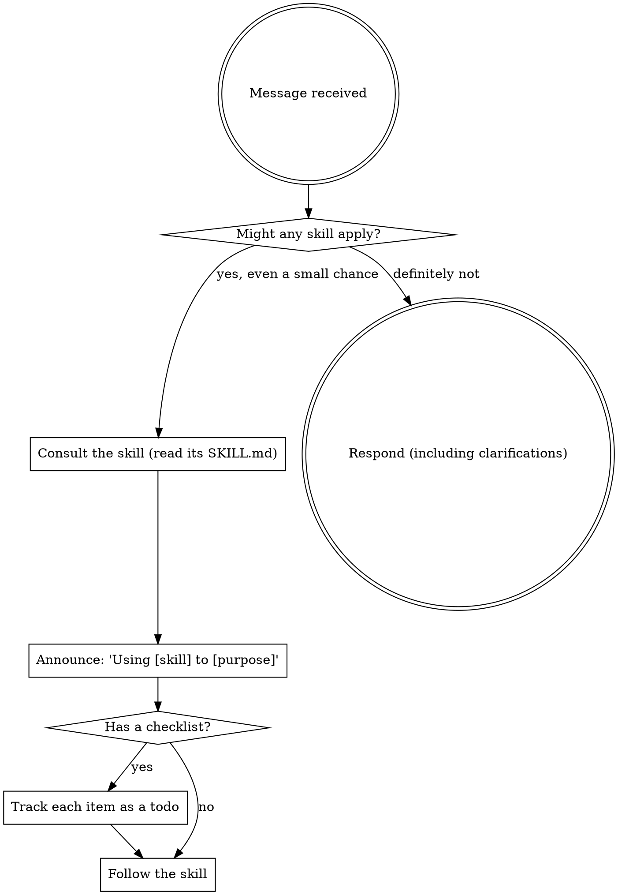

# Superpowers

This is a gateway skill. It does no domain work itself — its job is to make sure you actually *use* the other skills available to you instead of working from memory and improvising.

## Why this exists

The failure mode it prevents is real and specific: a relevant skill exists, you don't consult it, and you produce a worse answer than you would have with two minutes of reading. This happens because checking feels like overhead on an easy task, so you skip it — and "is this task easy?" is judged *before* you've read the skill that would have told you it isn't. Checking first is cheap. Re-doing work because you skipped the check is not.

## The Rule

Check for an applicable skill **before any response on a substantive request — including before asking clarifying questions.** If there's even a small chance a skill applies, consult it first. The clarifying questions you'd ask are often answered by the skill itself.

"Substantive" means anything beyond pure chitchat: a task, a question that needs real work, an action. A bare greeting doesn't need a skill check; "help me build X" does.

## How to check, by environment

The mechanism differs but the habit doesn't:

- **Claude Code**: skills are exposed through the Skill tool / skills list. Invoke it to see what's available and to load the relevant skill.
- **Claude.ai and other harnesses**: available skills are surfaced automatically in context (e.g. an `available_skills` list). Read the relevant `SKILL.md` directly (via your file-view tool) before acting on it.

Either way: find the skill, *read its current contents*, then follow it. Don't act from your memory of what a skill says — skills get revised, and a stale memory is how you end up confidently wrong.

## The flow

"Track each item as a todo" means TodoWrite in Claude Code, or your environment's task-tracking equivalent. If you have no tracking tool, keep the checklist visible in your working notes and tick through it explicitly.

## Red flags — the excuses that mean *stop and check*

These are the thoughts you'll have *right before* skipping a skill. If you catch yourself thinking one, that's the signal to check, not to proceed:

| The thought | The reality |
|---|---|
| "This is just a simple question." | Questions are tasks. Check first. |
| "I need more context before I can help." | The skill check comes *before* clarifying questions — the skill may supply the context. |
| "Let me look at the code/files first." | Skills tell you *how* to explore. Check before exploring. |
| "Let me gather some information first." | Skills tell you *how* to gather it. |
| "I already know how to do this." | If a skill exists for it, the skill encodes things you don't know or have forgotten. |
| "I remember what that skill says." | Skills get revised. Read the current version. |
| "A formal skill is overkill here." | Simple tasks turn complex. The cost of checking is tiny. |
| "I'll just do this one quick thing first." | "First" is the problem. Check before *anything*. |
| "This feels productive already." | Motion isn't progress. Skills are what make the motion count. |

## When several skills could apply

Order matters:

1. **Process skills first** (brainstorming, debugging, planning) — these decide *how* you approach the task.
2. **Implementation skills second** (a framework or domain skill) — these guide *execution*.

So "let's build X" → a brainstorming/planning skill before an implementation one. "Fix this bug" → a debugging skill before a domain-specific one.

## Rigid vs flexible skills

- **Rigid skills** (e.g. TDD, structured debugging) are disciplines. Follow them as written — the value *is* the discipline, so don't adapt it away because it feels slow.
- **Flexible skills** (patterns, guidelines) are principles to apply with judgment to your context.

The skill tells you which kind it is. When in doubt, treat it as rigid.

## Instructions say WHAT, not HOW

A user saying "just add X" or "quickly fix Y" specifies the goal, not permission to skip the workflow. The directness of a request is not a license to abandon the relevant skill. Use the skill, then deliver what they asked for.

---

## 2025–2026 Updates (verified June 2026)
- Anthropic's official skill spec confirms the discovery mechanics this skill relies on: only `name` (≤64 chars) + `description` (≤1024 chars, third-person, states *what + when*) are pre-loaded; the body loads on trigger; bundled files load on demand. Consequence: **the description is the trigger** — when a skill keeps under-firing, fix its description (pushier "use when" phrasing), don't lengthen its body.
- Precedence on name collision: enterprise > personal (`~/.claude/skills/`) > project (`.claude/skills/`); plugin skills namespace as `plugin:skill`.
- Multi-skill tasks: read every plausibly relevant SKILL.md (document creation often pairs format-skill + domain-skill); skills compose — consult, then sequence.
- Anti-staleness rule stays paramount: skills get revised; always read current contents, never act from memory of a skill.
