# Alpha Wolf Wrap Studio — MVP Handoff

**Prepared:** 2026-06-10 · **Environment:** production
(`https://alphawolfedecals-app-web.vercel.app`) · **Status:** MVP, pre-public-launch.

This package is the independent verification of the Alpha Wolf Wrap Studio MVP: what
it does, how it's built, its security and production posture, an honest list of
launch blockers, and a screenshot walk-through of the working product. Everything
below was verified against the live production system this session, not from
documentation.

---

## 1. What the MVP does

Alpha Wolf Wrap Studio is a web app that turns a vehicle-wrap order from a back-and-
forth email thread into a self-serve design-and-submit flow.

- **Customer** browses a catalogue of vehicle templates, opens one in an in-browser
  **design editor** (place artwork, shapes and text on accurate, wrap-safe vehicle
  panels; recolor; autosave), and **submits the design for production**, which
  creates an order. No payment in the MVP.
- **Wrap shop** sees orders routed to it in a **production queue**, opens an order,
  and moves it through the lifecycle (**submitted → in production → fulfilled**).
- **Email** notifications fire at each step (4 PII-safe templates); errors go to
  Sentry; product analytics to PostHog.

The end-to-end loop — sign in → design → submit → shop receives → fulfil — is
**proven working on production** (automated smoke, see §5 and §7).

---

## 2. Architecture snapshot

| Layer | Technology |
|---|---|
| Web app | Next.js 15 (App Router, React 19) on **Vercel** (region `sfo1`), Tailwind v4 + shadcn/ui, **Konva** canvas editor |
| Auth | Custom `@alphawolf/auth` on Auth.js v5 — argon2id passwords, email OTP, double-submit CSRF, DB-backed login lockout |
| Data | **Postgres** (Supabase, us-west-1) via Prisma; **row-level security (RLS) forced on every table** |
| Security boundary | **Two-connection split** — an `app_user` (non-superuser) connection with RLS enforced for all customer/shop queries; a privileged connection only for unauthenticated bootstrap |
| Storage | Supabase Storage — public bucket for vehicle templates, **private** bucket for customer artwork (signed-URL, ownership-checked) |
| Email / errors / analytics | Resend · Sentry (server+edge, PII-scrubbed) · PostHog |
| Background workers | `apps/api` (email-retry, asset parse) on Render |
| Monorepo | Turborepo + pnpm |

The architecture decisions are recorded as ADRs (`docs/adr/`); the deploy contract
is locked under ADR-0013 (amended this session — see §6).

---

## 3. Security & production posture

A full **security audit** and **production-readiness audit** were run against
production this session (reports in `docs/deployment/audits/2026-06-09-goal-4/`).

**Security: PASS — no High/critical live failure.** Verified live, not from code:

- RLS is **forced on all 14 tables**; the orders table's customer/shop policy triple
  was confirmed live (a customer sees only their orders; a shop sees only orders
  routed to it; cross-tenant access returns nothing).
- 6 security headers + a comprehensive CSP, **byte-identical** between source and the
  live response (HSTS 2 yr, X-Frame DENY, hardened `__Host-` session cookies).
- **Zero secrets** in client-shipped code. Dev/admin backdoor endpoints are hard-404
  in production (verified). Every state-changing action enforces authentication +
  authorization + CSRF + RLS. Hardened file-upload path. No XSS sinks. argon2id +
  DB-backed brute-force lockout.
- Supabase database advisors: **2 low warnings, down from 4** after this session's
  fix (no new warnings introduced).

**Production-readiness: functionally launch-ready for a demo**, with a standard
pre-public-launch hardening list (§6). Health endpoint live; CI/CD auto-deploys
`main`; clean dependency + lockfile hygiene.

**Performance (Lighthouse, prod):** Performance ~88–89, Accessibility 100,
Best-Practices 92, all stable vs the prior baseline. (SEO reads low only because the
site intentionally blocks crawlers pre-launch; it reverts at launch. Details in
`docs/deployment/lighthouse-2026-06-10/`.)

---

## 4. What was found and fixed this session

A verification goal's job is to surface what's actually true. Two significant issues
were found; one was fixed under full review, one is a data gap flagged for launch.

- **FIXED — production RLS recursion bug (was High).** The membership policy
  referenced itself, so reading any order routed to a shop threw an infinite-
  recursion error — the entire shop-order path (submit-routed, dashboard read, status
  transitions) was broken. It was dormant only because no order had ever been routed
  to a shop. **No data was ever exposed** (it failed closed — an error, never
  over-broad visibility). Fixed with a security-definer helper, reviewed
  (independent + advisor), verified live across six gates, and merged (PR #116). The
  same change also closed two pre-existing database advisor warnings.

- **FLAGGED — the design editor has no design surface on the catalogue templates
  (High launch blocker; data gap, not a code gap).** The 3 curated Alpha Wolf
  catalogue templates (BMW X3, Bass Boat, Crown Coach) have **no panel geometry**, so
  the editor opens but you can't place artwork on them. The editor itself **works
  end-to-end** — proven on the Ford Transit template (6 panels): place, color,
  save, submit all function (see §7). What's missing is the per-template panel data.
  See §6 for the remediation spec.

---

## 5. Verification performed (evidence)

- **End-to-end smoke on production — PASS (customer + shop loops).** Two pre-seeded,
  verified accounts (created through the app's real argon2id + HMAC code path) drive:
  sign-in → browse → editor → submit → order created (customer); sign-in → queue →
  accept → fulfil (shop). Both green.
- **RLS isolation proven from a second identity:** a shop member reads only their
  routed order; a non-member sees zero; the customer (owner) sees their own. No
  recursion, no leak.
- **Two audits + Lighthouse + database advisors** run live (reports in `docs/`).
- **12-screenshot demo set** captured from production (§7).

---

## 6. Known gaps & launch blockers (ranked)

| # | Item | Severity | Owner / remediation |
|---|---|---|---|
| 1 | **Catalogue templates have no panel geometry** — editor non-functional on the 3 AW templates | **High** | Author a panel set per flagship template: a structured SVG with per-panel/per-view classes + wrap-safe zones (the schema the editor reads). Must be authored in-house or from **licensed** sources — **never** from the PVO outlines (Goal 1 license verdict is RESTRICTIVE; hard legal boundary). Est. modest effort per vehicle. The B2C roadmap's guided-design zone-selector (B2C-003) depends on the same data — fixing this unblocks both. |
| 2 | **Edge rate-limiting not active on prod** | Med | Set `UPSTASH_REDIS_REST_URL/TOKEN` on Vercel + redeploy (runbook: `docs/deployment/runbooks/enable-edge-rate-limiting.md`). Credential brute-force is already guarded by the DB lockout; this adds the edge throttle. |
| 3 | **Artwork-upload Server Action returns 500** | Med | A 500 on the upload path surfaced in testing (cause hidden by Next's prod error-digest). Resolve the digest in Sentry or repro locally; root-cause before relying on uploads in a demo. |
| 4 | **Email deliverability** (GH-016) | Med | Resend domain verified 2026-06-09; do one real end-to-end send + confirm in the Resend dashboard. |
| 5 | Legal: `/terms` + `/privacy` are stubs; no cookie consent | Med | Replace stub copy with reviewed legal text before public launch. |
| 6 | No uptime monitor; Dependabot just added; no backup restore-drill | Med | Wire an uptime monitor on `/health`; let Dependabot run; perform one restore drill before the first real signup. |
| 7 | Verify `DATABASE_URL_APP` is set on Vercel prod | Verify | A missing value silently disables RLS. The live cross-tenant test passed, which proves it is set today — re-confirm before launch. |

**Deferred to v1.1 (tracked):** editor testids for the uploaded-image place/color
smoke asserts; customer→shop order routing in the UI (today orders are seeded-routed
for the shop loop); CI durability for the shop smoke (per-run order seeding); the
CSP nonce migration; disabling the unused PostgREST data API.

---

## 7. Demo walk-through

All captured from **production** against seeded accounts. Editor shots use the Ford
Transit (the panel-bearing template) per §4/§6.

**1. Catalogue gallery** — the curated template gallery.

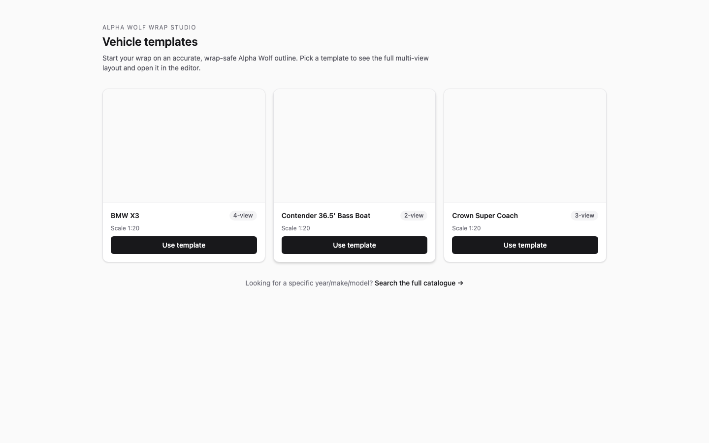

**2. Template detail** — the design call-to-action.

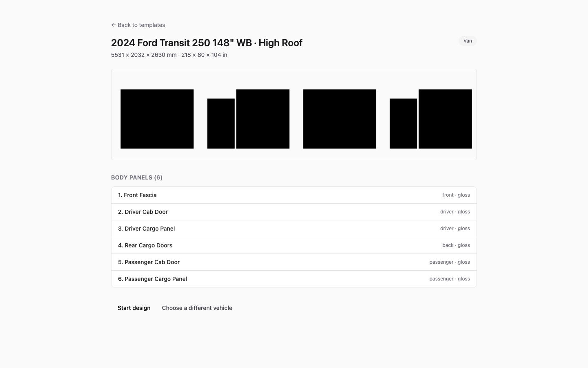

**3. Editor (empty)** — the Ford Transit's 6 panels render.

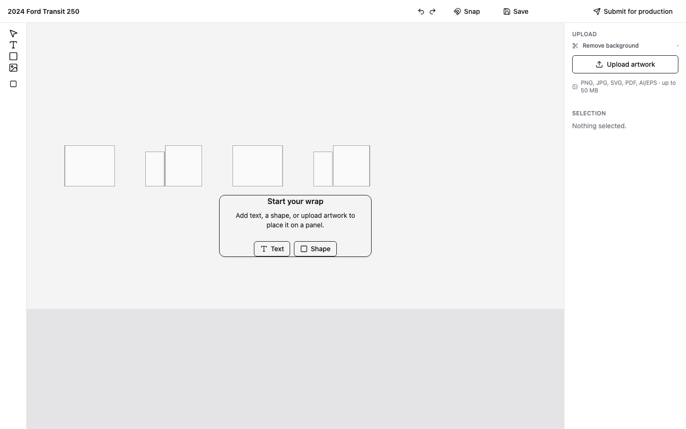

**4. Shape placed** — a shape on the Front Fascia panel (the placement engine works).

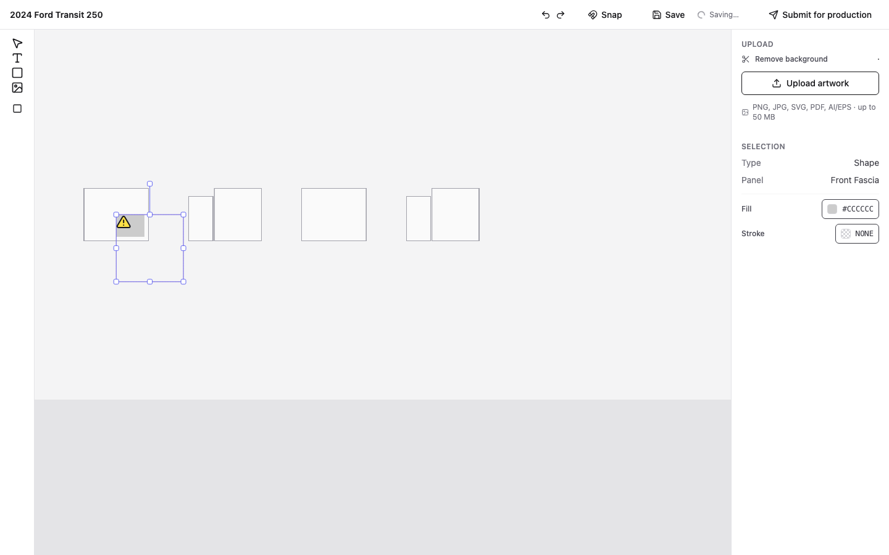

**5. Recolored** — the shape set to red via the inspector (place + color both work).

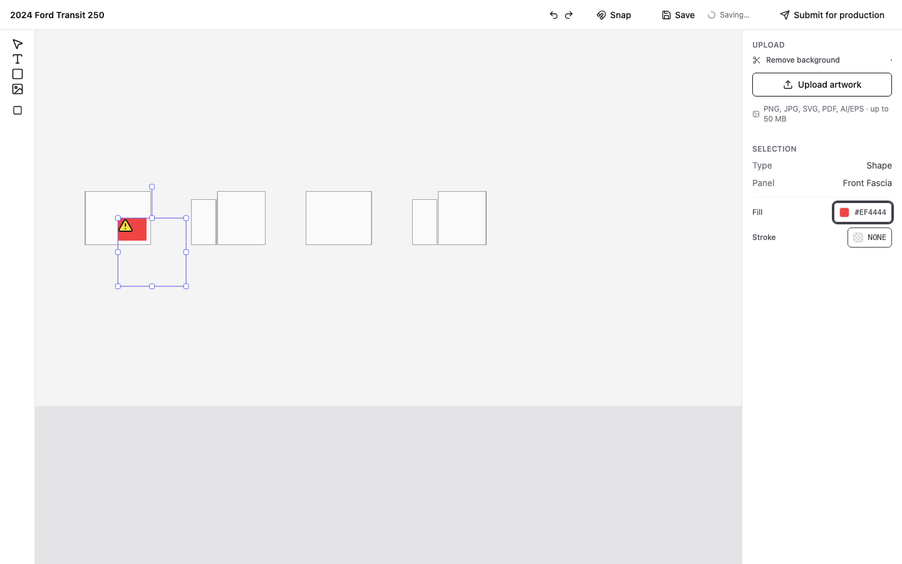

**6. Saved** — manual save / autosave flush.

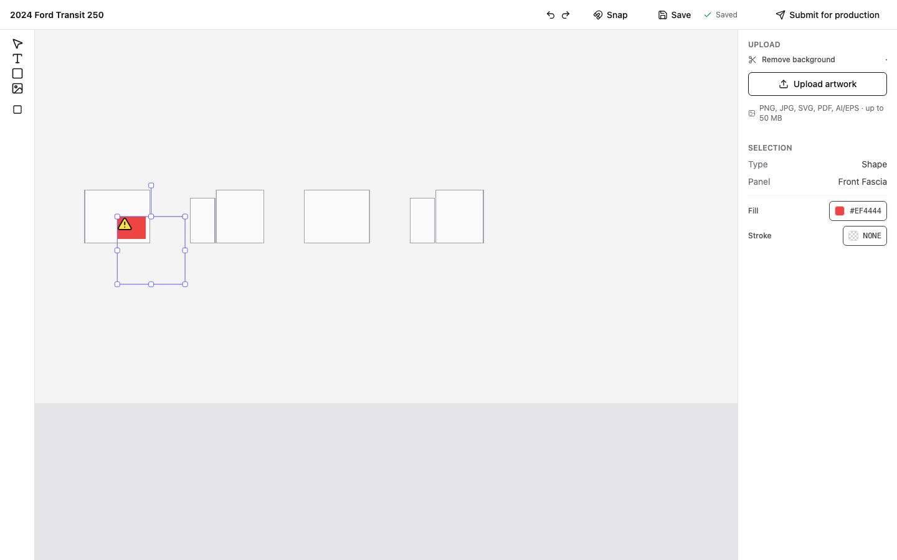

**7. Submit dialog** — contact details; no payment in the MVP.

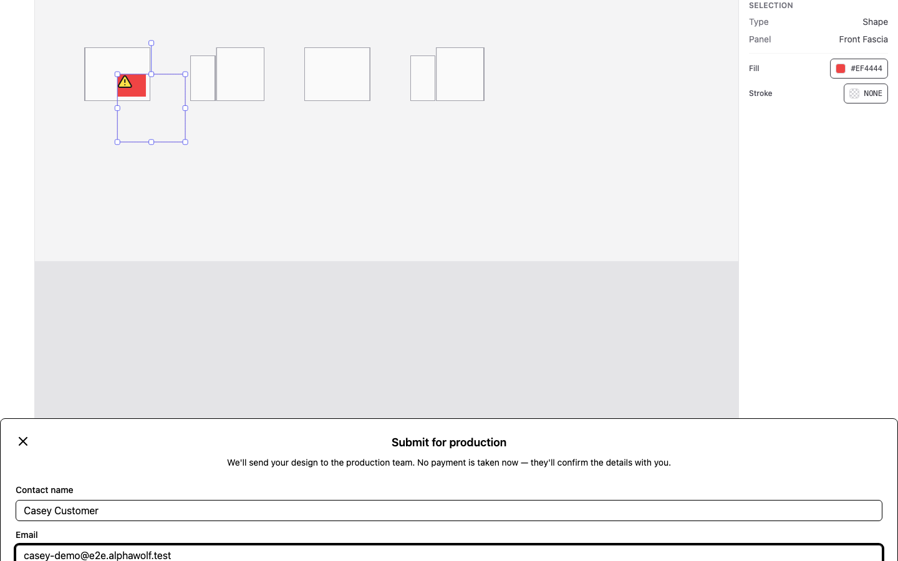

**8. Order confirmed** — the order is created.

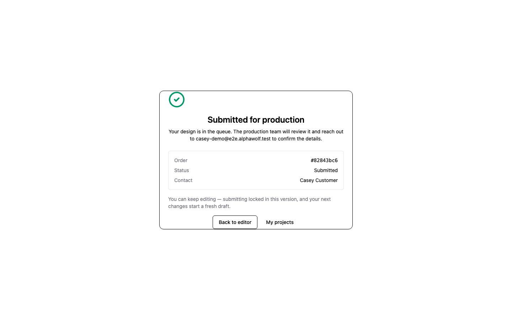

**9. Shop queue** — the routed order appears, RLS-scoped to the shop.

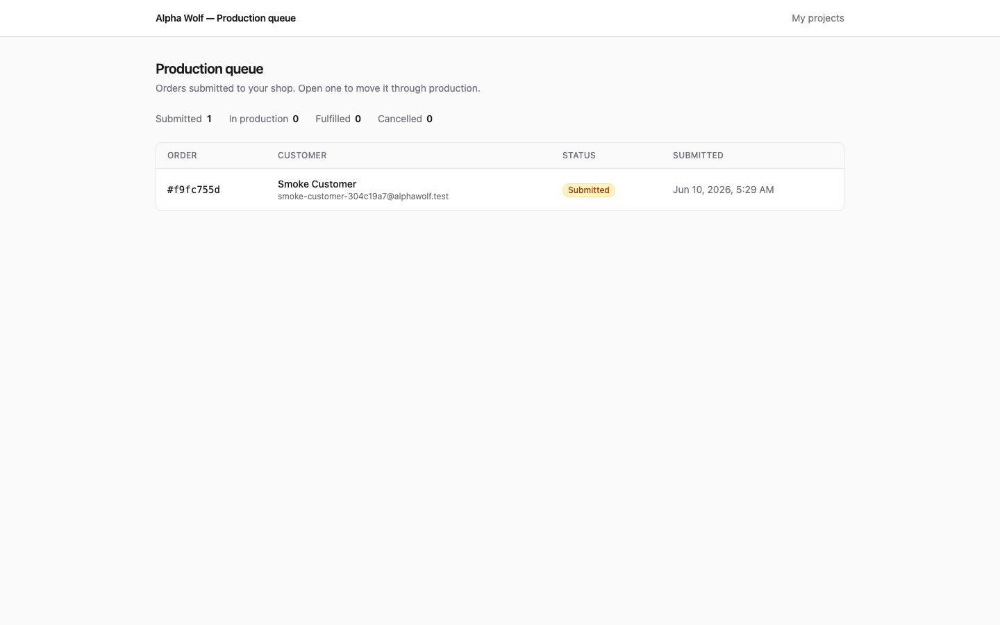

**10. Order detail** — the shop's view of the order.

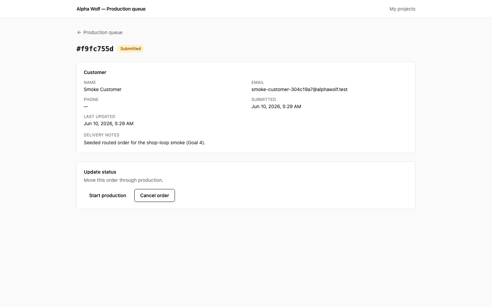

**11. In production** — after the shop accepts.

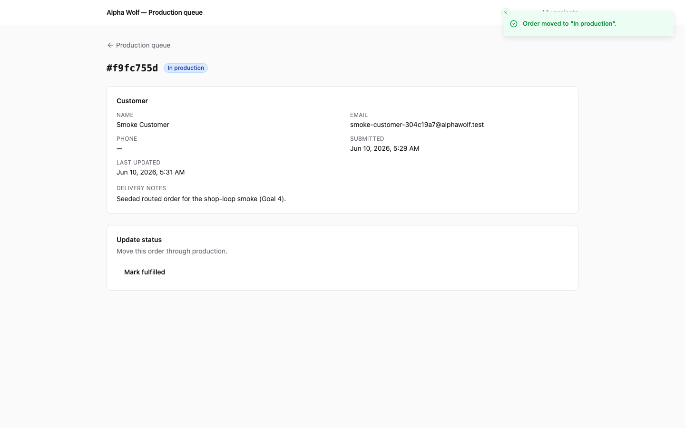

**12. Fulfilled** — after the shop marks it complete.

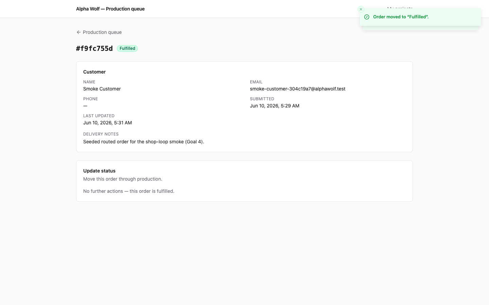

---

## 8. Bottom line

The MVP's spine is real and verified on production: secure-by-construction auth and
data isolation, a working design editor, and a complete customer→shop order
lifecycle. The single thing standing between this and a compelling end-to-end demo on
the flagship catalogue is **panel data for the 3 Alpha Wolf templates** (gap #1) —
an authoring task, not an engineering rebuild. The remaining items are the normal
pre-public-launch hardening checklist.
