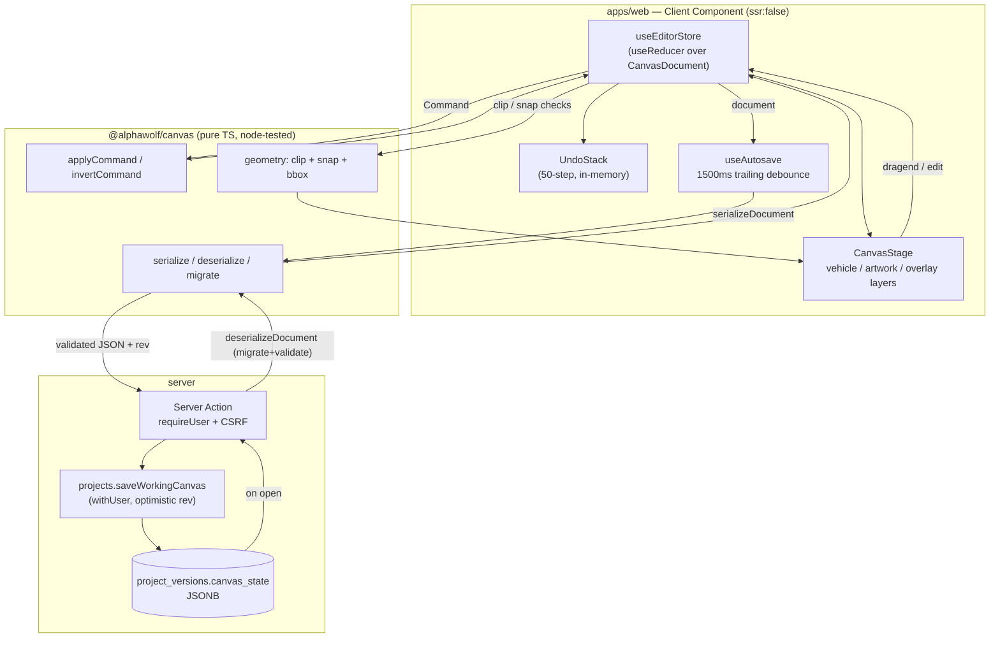

# ADR-0006: Konva canvas editor data model and persistence

- **Status**: Accepted
- **Date**: 2026-05-20
- **Deciders**: Archer
- **Related stories**: GH-008 (canvas editor), GH-005 (assets the editor places)
- **Supersedes**: n/a

## Context

GH-008 introduces the wrap editor: the user places text/shapes/images onto a
vehicle's panels, constrained to each panel's wrap-safe (printable) area, with
undo/redo and autosave. Every future editor PR (AI generation GH-006/007, print
paneling GH-010, export GH-011, project transfer GH-012) inherits the data model
chosen here — how elements serialize to JSON, how undo stacks, how an old
`canvas_state` opens after the schema evolves. So the model is load-bearing and
must be decided deliberately, not grown ad hoc.

Three things in the obvious approach are technically wrong and are corrected here:

1. **Coordinates are view-local, not global.** The vehicle SVG (validated per
   `docs/vehicle-database-spec.md` §3) nests panel paths inside
   `<g data-view transform="translate(…)">`, so panel `d` strings are in
   _view-local_ coordinates. A "global centerline" cannot be derived from the
   path `d` alone. **Decision:** elements are stored **panel-local**; the view
   transform lives only in the React/Konva layer. Geometry math stays
   transform-free, and moving artwork between panels is a reparent, not a
   coordinate rebase.
2. **Point-in-path / clip math cannot use the DOM.** The geometry must be
   unit-testable in plain `node` vitest (no jsdom), so `Path2D` /
   `ctx.isPointInPath` are banned. **Decision:** parse the wrap-safe `d` into
   polygon rings ourselves (flattening `C/Q/A` via subdivision) and ray-cast in
   pure TS. This is _why_ the geometry lives in `@alphawolf/canvas`.
3. **Konva must never reach the server bundle.** The editor is a Client
   Component; `serverExternalPackages` alone is insufficient. **Decision:**
   `dynamic(import, { ssr:false })` + a webpack `externals` entry for `canvas`
   (the native Konva server peer). See §"Server-bundle isolation".

## Decision

### 1. `@alphawolf/canvas` is a framework-agnostic pure-TS core

DOM-free, React-free, Konva-free. Enforced mechanically: the package's tsconfig
`lib` is `["ES2022"]` only (any DOM API is a compile error) and the React peer
dep is removed. Konva/React components that _use_ the core live in `apps/web`.

```
packages/canvas/src/
  schema/        types.ts · versions.ts · defaults.ts
  serialization/ serialize.ts · deserialize.ts · migrate.ts
  history/       command.ts · stack.ts · apply.ts
  geometry/      path-parse.ts · polygon.ts · hit-test.ts · snap.ts · bbox.ts
```

### 2. Canvas-state JSON schema

A flat `elements` map keyed by branded `ElementId` + a per-panel ordered
`elementIds` array (z-order). Elements are a discriminated union on `type`
(`text | shape | image`) over a shared `BaseElement` (id, panelId, view,
panel-local x/y, rotation, scale, opacity, finishSwatch, zIndex, locked).
The document carries `schemaVersion`, `vehicleId`, `panels`, `elements`,
`selection`, `seq`. Rationale: commands address elements by stable id; z-order
is an explicit array (reorder = splice); `noUncheckedIndexedAccess` is honored
because lookups are explicit.

### 3. Undo/redo = command stack (deltas), not snapshots

One "step" = one user-perceivable mutation (a drag commits **once** on
`dragend`, not per `dragmove`; text edits coalesce per focus session).
`Command` is a small delta union (`addElement(s)`, `removeElements`,
`updateElements` with before/after patches, `reorder`, `reparent`).
`applyCommand(doc, cmd)` is pure; `invertCommand(cmd)` powers undo. History is a
**50-step ring buffer, in-memory per session** — only the current document
persists; reopening starts with empty undo/redo. Memory bound is kilobytes, not
megabytes of cloned documents.

### 4. Persistence: one mutable working row + milestone snapshots

Each project has exactly one `project_versions` row with
`approval_state='working'` (the highest version). Autosave **UPDATEs it in
place** — trailing-edge debounce, 1500 ms idle, 10 s hard max-wait, plus a flush
on `visibilitychange:hidden`/`beforeunload`. No leading edge (avoids writing
half-finished interaction states). Bumping `version` on every autosave would
generate hundreds of junk rows, so milestones (submit/approve/reject, or an
explicit "save version") instead **freeze** the working row and **clone** a new
working row forward at `version+1` — append-only meaningful history without
autosave noise.

**Concurrency = optimistic `rev`.** The working row carries an int `rev` bumped
on each UPDATE. The autosave action sends the rev it loaded with; the repo does
`updateMany WHERE id AND rev = expected … rev: increment`. Zero rows affected →
another tab/device advanced it → `{ ok:false, reason:'stale' }` and the client
reloads. This is single-editor last-write-wins, not co-editing.

The repo (`packages/db/src/repos/projects.ts`) treats `canvas_state` as **opaque
JSON** and does NOT depend on `@alphawolf/canvas`. The Server Action
(`apps/web/lib/actions/project.ts`) runs `deserializeDocument → serializeDocument`
to **migrate + validate the client JSON before it touches the JSONB column** —
never trust raw client JSON into the DB, and keep the geometry package out of the
server bundle.

### 5. Forward-compat versioning

`CURRENT_SCHEMA_VERSION` increments only; a never-deleted migrate-on-load
registry upgrades `k → k+1 → … → CURRENT`. `deserializeDocument` migrates then
validates **by hand** (no zod dep — the package stays dependency-free); unknown
element `type`s are dropped with a collected warning so one bad element can't
brick a project; a document newer than the client throws `CanvasSchemaError`.
**Rule:** every schema-changing PR adds a migrator + a `migrate.test.ts` fixture
of the prior version.

### 6. 60fps with 200 elements — Konva topology

**3 layers, ~200 nodes — never one layer per element.**

- `vehicleLayer` (`listening:false`, cached) — outline + per-panel `clipFunc`
  groups. Static; removed from the hit graph.
- `artworkLayer` — one `<Group>` per view (the translate transform) → one
  `<Group>` per panel (the wrap-safe `clipFunc`) → element nodes.
- `overlayLayer` (`FastLayer` for guides) — transformer, snap guides, the
  out-of-bounds cue.

Node settings: `perfectDrawEnabled:false`, `shadowForStrokeEnabled:false`,
`hitStrokeWidth:0` where strokes aren't interactive, `listening:false` on locked
elements, `panelGroup.cache()` for static panels. Drag moves only the dragged
node and `layer.batchDraw()`s — no React setState / history per `dragmove`.

### 7. Per-panel wrap-safe clipping + out-of-bounds cue

Each panel `Konva.Group` has a `clipFunc` built from the parsed wrap-safe rings,
so artwork clips visually on render. `clipFunc` does not _prevent_ dragging out,
so once per animation frame during a drag we compute the element bbox and run
`geometry.isElementInsideClip(bbox, rings)` (pure CPU, no canvas readback). On
violation we toggle a **single overlay node** (red bbox outline) on the overlay
layer — O(1), never touching the 200-node artwork layer. Persisted violations
feed a derived `Set<ElementId>` so the export/approval path can later refuse to
proceed.

### 8. Server-bundle isolation

`canvas` (Konva's native server peer) and `sharp` are added to both
`serverExternalPackages` and the webpack server `externals` in `next.config.ts`
(mirroring the existing `@node-rs/*` + `svgo` handling). The editor is mounted
via `dynamic(() => import('@/components/editor/CanvasEditor'), { ssr:false })`.
`konva`/`react-konva` are `apps/web` deps only — never in `@alphawolf/canvas`.

## Data-flow



## Consequences

- **Good:** the print-safety math (is an element inside the printable area) is
  headlessly unit-testable — a hard requirement for trustworthy paneling later.
  The model is small, versioned, and forward-compatible; autosave is cheap and
  conflict-safe; the editor can't leak Konva into SSR.
- **Cost:** we parse SVG paths ourselves rather than leaning on the browser —
  more code, but it's the only DOM-free option and it's covered by tests. Text
  bbox is approximated in the core (no glyph engine); the render layer supplies
  exact metrics when needed.
- **Transfer-on-handoff (GH-012):** `transfer_token` lives on `projects`;
  because history is in-memory and only the current document persists, a transfer
  hands over the working row's `canvas_state` cleanly with no redo-tree baggage.
- **Deviation log:** the implementation added an `addElements` (plural) command
  beyond the five originally listed, to give `removeElements` a clean atomic
  inverse for multi-element undo. No other departures from the design.
