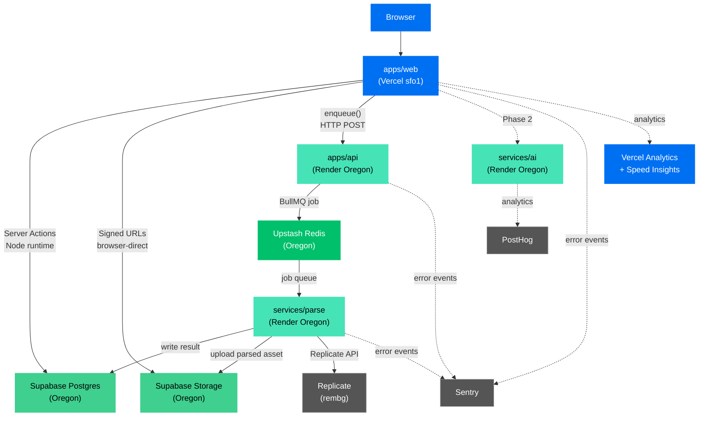

# ADR-0012: Production deployment architecture (Phase 1)

- **Status**: Accepted
- **Date**: 2026-05-22
- **Deciders**: Archer
- **Related stories**: All Phase 1 stories; Phase 4 launch prep
- **Supersedes**: n/a

## Context

Phase 1 is feature-complete on `main` (PRs #38 and #39). The three Node/Python services
(`apps/api`, `services/parse`, `services/ai`) and the Next.js app (`apps/web`) need a
deterministic, documented production topology so the first Phase 1 demo can be executed
reproducibly and the Phase 2–4 team inherits a clear operational baseline.

Key constraints feeding this decision:

- **Cost cap**: ≤ $50/month across all vendors for Phase 1 dev + demo traffic.
- **Region alignment**: all backend services should be Oregon-adjacent to minimize
  latency between Vercel functions, the Supabase Postgres/Storage cluster
  (`aws-1-us-west-1`), and the Upstash Redis database (`aws-us-west-2`).
- **Security boundary**: `DATABASE_URL_APP` (RLS-enforced app_user connection) must never
  be replaced with `DATABASE_URL` (superuser bypass) in any deployed runtime context.
  The `withUser`/`withSystem` boundary from ADR-0002 is non-negotiable.
- **Scrubber requirement**: every deployed Sentry init must carry `sendDefaultPii: false`
  and `beforeSend: scrubSentryEvent` from `@alphawolf/observability` (ADR-0011).

## Decision

### Service topology

| Service             | Host                              | Region                 | Type                | Notes                                                     |
| ------------------- | --------------------------------- | ---------------------- | ------------------- | --------------------------------------------------------- |
| `apps/web`          | Vercel Hobby                      | `sfo1` (San Francisco) | Next.js             | Closest available Vercel region to Oregon                 |
| `apps/api`          | Render Free                       | Oregon (`us-west`)     | Node.js web service | Express on `$PORT`                                        |
| `services/parse`    | Render Free                       | Oregon (`us-west`)     | Node.js worker      | BullMQ consumer + Express health                          |
| `services/ai`       | Render Free                       | Oregon (`us-west`)     | Python web service  | FastAPI via uv + uvicorn                                  |
| Postgres            | Supabase                          | `aws-1-us-west-1`      | Managed             | Existing project `dxwnzxlmggpdjyoxdybh`                   |
| Object storage      | Supabase Storage                  | Same project           | Managed             | `vehicle-templates` + `project-assets` buckets            |
| Queue / cache       | Upstash Redis                     | `aws-us-west-2`        | Managed             | Existing database `certain-bass-131284`                   |
| Error tracking      | Sentry                            | SaaS                   | Managed             | One project "node"; `environment` tag differentiates envs |
| Analytics           | PostHog                           | SaaS                   | Managed             | `services/ai` only (Phase 1)                              |
| Web analytics       | Vercel Analytics + Speed Insights | Vercel                 | Managed             | `apps/web` only                                           |
| Transactional email | Resend                            | SaaS                   | Managed             | Sandbox sender for Phase 1 demo                           |
| AI inference        | Replicate                         | SaaS                   | Managed             | `cjwbw/rembg` background removal                          |

### Vercel configuration (apps/web)

Region `["sfo1"]` is pinned in `/apps/web/vercel.json`. `pdx1` is not a generally available
Hobby-tier region; `sfo1` adds only 5–15ms latency to Oregon services vs the 60–80ms penalty
from the default `iad1` (Virginia).

**Per-route rendering strategy** (informed by `vercel-deployment-specialist` agent):

| Route                         | Strategy                      | Rationale                                                                     |
| ----------------------------- | ----------------------------- | ----------------------------------------------------------------------------- |
| `/`                           | SSG (static)                  | No runtime data; served from CDN edge                                         |
| `/vehicles`                   | ISR, `revalidate: 3600`       | Infrequent updates; avoids per-request DB hit                                 |
| `/vehicles/[id]`              | ISR, `revalidate: 3600`       | Same; `generateStaticParams` for top vehicles                                 |
| `/projects`, `/projects/[id]` | `force-dynamic`               | RLS-scoped per user; caching is dangerous                                     |
| `/projects/[id]/editor`       | `force-dynamic`, Node runtime | Auth ownership check server-side; Konva is client-only (`dynamic, ssr:false`) |
| `/api/(public)/health`        | Edge runtime                  | No Prisma, no Node APIs; zero cold-start; multi-PoP coverage                  |

Function `maxDuration` (Vercel Hobby max = 60s):

- Health: 5s
- Standard Server Actions (DB reads/writes, project save): 15s (global default)
- Future parse-job enqueue + status poll: 60s (Phase 2 — not yet defined as a route)

**Image optimization** (Supabase Storage URLs):

- `remotePatterns`: `dxwnzxlmggpdjyoxdybh.supabase.co`, path `/storage/v1/object/public/**`
- `formats`: `['image/avif', 'image/webp']` (AVIF first — 40-50% smaller than WebP)
- `minimumCacheTTL`: 2592000 (30 days — vehicle/decal images are immutable on upload)
- `deviceSizes`: `[320, 640, 768, 1024, 1280, 1920]`

**Cold-start and pgBouncer**: `connection_limit=1` is correct and must not be raised.
Each Vercel function instance is isolated; raising to N would produce N × (concurrent
instances) simultaneous pgBouncer connections under load. Transaction mode + the existing
`?pgbouncer=true` flag already disables prepared statements (the most expensive part of
connection setup). The PrismaClient singleton in `@alphawolf/db/src/client.ts` is already
module-level, so warm invocations reuse it.

### Render configuration (apps/api + services/parse + services/ai)

All three services deploy from a single GitHub repo via `/render.yaml`. Auto-deploy on
push to `main`; preview deploys are supported on Render paid tiers (Phase 4 follow-up,
issue logged below).

**`alphawolf-api`** — Node.js web service, public URL, `/health` health check.

**`alphawolf-parse`** — Node.js worker service. The primary function is the BullMQ queue
consumer; the Express HTTP server provides a `/health` endpoint but the service is not
publicly routable. Uses Render's "background worker" type so it's not fronted by a load
balancer; process liveness is the health signal.

Note: `inkscape` and `pdf2svg` are NOT installed in the Phase 1 deploy (Render free-tier
build time is constrained; both are heavy packages). AI/EPS/PDF uploads will resolve to
`parse_status = 'queued_missing_cli'` rather than failing. PNG/JPEG/SVG/rembg all work.
Phase 4: migrate to a Docker-based Render service with inkscape/pdf2svg pre-installed
(tracked as a Phase 4 follow-up).

**`alphawolf-ai`** — Python FastAPI web service, public URL, `/health` health check. Uses
`uv` for dependency management.

### Environments

Three environments:

| Environment   | `apps/web`                      | `apps/api` / parse / ai                 | Description              |
| ------------- | ------------------------------- | --------------------------------------- | ------------------------ |
| `production`  | Vercel production (main branch) | Render services, `NODE_ENV=production`  | Live Phase 1 demo        |
| `preview`     | Vercel preview (per PR, auto)   | Not deployed per-PR (Phase 4 follow-up) | PR previews for web only |
| `development` | `localhost:3000`                | `localhost:4000/4001` + Python services | Local dev                |

### Secret management

All secrets are stored in the respective host's secret store:

- **Vercel**: Project env vars (scope = Production + Preview or Production-only)
- **Render**: Service env vars (marked `sync: false` in render.yaml so values are never
  committed)

No secret ever enters:

- A committed file (including `.env.example` — that file has keys, never values)
- A Claude Code transcript
- A PR body, commit message, or ADR text
- A `NEXT_PUBLIC_*` variable (client bundle) for secrets that should be server-only

Rotation procedure and owner per secret: see `/docs/deployment/env-matrix.md`.

### Observability

- **Sentry**: single project "node"; `SENTRY_ENVIRONMENT` env var differentiates
  `production` / `preview` / `development`. Separate Sentry environments (not separate
  projects) keep error grouping unified across deployments.
- **PostHog**: `services/ai` only (Phase 1). `POSTHOG_API_KEY` env var; disabled when
  absent.
- **Vercel Analytics + Speed Insights**: `apps/web` only. No-op outside Vercel hosting.
- **Dashboard URLs**: see `/docs/vault/70-quick-reference.md` §Production deploy.

### Cost projection (Phase 1 demo + early production)

| Vendor         | Tier                   | Projected monthly cost    | Limit risk                                              |
| -------------- | ---------------------- | ------------------------- | ------------------------------------------------------- |
| Vercel         | Hobby (free)           | $0                        | 100 GB bandwidth; 100k function invocations/day         |
| Render (api)   | Free                   | $0                        | Spins down after 15 min idle; ~30s cold start           |
| Render (parse) | Free                   | $0                        | Same spin-down behaviour                                |
| Render (ai)    | Free                   | $0                        | Same spin-down behaviour                                |
| Supabase       | Free                   | $0                        | 500 MB DB, 1 GB storage, 2 GB egress/month              |
| Upstash Redis  | Free                   | $0                        | 256 MB, 500k commands/month                             |
| Sentry         | Free (5k errors/month) | $0                        | Ratchet `tracesSampleRate` from 1.0 → 0.1 before launch |
| PostHog        | Free (1M events/month) | $0                        | Gate /health captures (issue #59)                       |
| Resend         | Free (3k emails/month) | $0                        | Sandbox sender for Phase 1 demo                         |
| Replicate      | Pay-per-use            | ~$0–2/month at demo scale | ~$0.001/rembg run                                       |
| **Total**      |                        | **~$0–2/month**           | Well within $50 cap                                     |

At Phase 4 launch scale (100 DAU, 500 rembg jobs/day), Vercel + Render would both likely
need paid tiers. Revisit at Phase 4.

**Upstash capacity analysis**: 500k commands/month at demo scale (10 users, 50 jobs/day,
~20 BullMQ commands/job) = ~30k commands/month. Headroom: 94%. Redis storage at ~1 KB/job
× 50 jobs/day × 30 days = ~1.5 MB. Headroom vs 256 MB: ample.

**Supabase capacity**: DB storage at Phase 1 is <10 MB (vehicle templates + project data).
Storage bucket: ~50 MB of uploaded decal assets for the demo. Both well under free-tier
limits.

### Rollback

**Vercel rollback:**

1. **Previous deployment**: `vercel rollback` — instantly promotes the prior production
   deployment. No rebuild.
2. **Specific deployment**: `vercel rollback https://<deployment-url>.vercel.app`
3. **Zero-downtime alias swap**: `vercel alias set <url> <your-domain>` — atomically
   reassigns the production alias.
4. **Dashboard path**: Vercel Dashboard → Project → Deployments → ⋯ → Promote to Production.

**Render rollback:**

1. Navigate to Render Dashboard → Service → Events.
2. Find the target deployment → "Redeploy" — Render re-runs the same commit's build.
3. For an emergency: in the Service settings, change the deploy branch to a tag pointing at
   the known-good commit, then redeploy.

**Database migration rollback (Phase 2 prep):**
Phase 1 adds no destructive migrations. For Phase 2+: run `prisma migrate dev --name rollback_<name>` to write a forward-only rollback migration (never `prisma migrate reset` in production). The Supabase project has Point-in-Time Recovery on the paid tier (Phase 4 follow-up: PITR rehearsal — issue logged below).

## Alternatives considered

- **Fly.io instead of Render**: Fly.io offers persistent process VMs (no spin-down on
  free tier's "Machines" product) and a `fly.toml` per-app config. Chosen against in
  favour of Render because Render's `render.yaml` supports the entire multi-service
  monorepo in a single file, Render's free tier is simpler for the Phase 1 demo, and the
  spin-down penalty (~30s cold start) is acceptable for a demo workload. Revisit at Phase 4
  if spin-down latency becomes customer-visible.

- **Railway instead of Render**: Railway supports pnpm monorepos natively and has no
  spin-down on its free tier (5 USD/month credit). Chosen against because Render is
  free at Phase 1 scale with no credit card required, and the operational model is
  familiar. Revisit at Phase 4.

- **pdx1 (Portland) instead of sfo1 (San Francisco)**: `pdx1` is not a generally available
  compute region on Vercel Hobby tier. `sfo1` is the closest available region to Oregon
  services.

- **Separate Sentry projects per environment**: Chosen against — separate environments on
  the same project preserve cross-environment error grouping and issue history. The
  `SENTRY_ENVIRONMENT` tag provides sufficient separation for alert routing.

- **Docker-based Render services for inkscape/pdf2svg**: Correct for Phase 4. Deferred
  because free-tier managed services are zero-configuration; Docker would require
  maintaining a Dockerfile and a container registry. The graceful-degradation path
  (`queued_missing_cli`) makes this safe to defer.

## Consequences

**Positive**

- Zero recurring cost through Phase 1 demo and early beta.
- All backend services in Oregon, minimising Supabase/Redis round-trip latency.
- Sentry environments (not projects) keep error history unified.
- `render.yaml` is declarative and version-controlled; no manual service configuration
  in the Render dashboard beyond secrets.
- Rollback on Vercel is instant (no rebuild); Render rollback is one click.

**Negative**

- Render free-tier services spin down after 15 minutes of inactivity. The first request
  after spin-down has a ~30s cold start. Acceptable for a demo; unacceptable for production.
  Phase 4 must upgrade to Render Starter or migrate to a host without spin-down.
- inkscape/pdf2svg are not installed in the Phase 1 parse worker. AI/EPS/PDF uploads
  degrade gracefully (`queued_missing_cli`) but do not convert. Document in the demo script.
- No per-PR Render preview deploys. Vercel previews cover the web tier; the API and
  Python services are not previewed per-PR. Phase 4 follow-up.
- Vercel Hobby function execution is capped at 100k invocations/day and 60s max duration.
  Both are fine for Phase 1 demo; review at Phase 4 launch.
- Resend sandbox sender (`onboarding@resend.dev`) only delivers OTP emails to the Resend
  account owner's mailbox. Adequate for Phase 1 demo (Archer is the demonstrator).

**Follow-ups**

- Phase 4: upgrade Render free → Starter (no spin-down), or migrate to Fly.io Machines.
- Phase 4: Docker-based parse service with inkscape + pdf2svg pre-installed.
- Phase 4: Render preview deploys per PR (Render paid tier required).
- Phase 4: Supabase PITR rehearsal (point-in-time recovery).
- Phase 4: Sentry quota ratchet — `tracesSampleRate` 1.0 → 0.1 after first 1k transactions.
- Phase 4: custom domain (`alphawolfwrap.com`) — Vercel + Resend + Sentry tunnel.
- Phase 4: pen test scope definition before public launch.

## Architecture diagram

## References

- ADR-0001 — locked stack (technology choices this ADR builds on)
- ADR-0002 — `withUser`/`withSystem` RLS boundary (production DB connections)
- ADR-0007 — Supabase Storage strategy (buckets, signed URLs, service-role key)
- ADR-0009 — parse queue (BullMQ/Upstash; inline fallback when `REDIS_URL` absent)
- ADR-0011 — observability boundaries (Sentry scrubber requirement)
- `/docs/deployment/env-matrix.md` — complete env var matrix with rotation procedures
- `/docs/deployment/vercel-env.md` — Vercel env var checklist
- `/docs/deployment/render-env.md` — Render env var checklist
- `/render.yaml` — Render service definitions
- `/apps/web/vercel.json` — Vercel configuration
- `/activities.md` entry 2026-05-22 — deployment session log
- [Vercel region codes](https://vercel.com/docs/edge-network/regions)
- [Render YAML spec](https://render.com/docs/yaml-spec)
- [Render free-tier limitations](https://render.com/docs/free)
