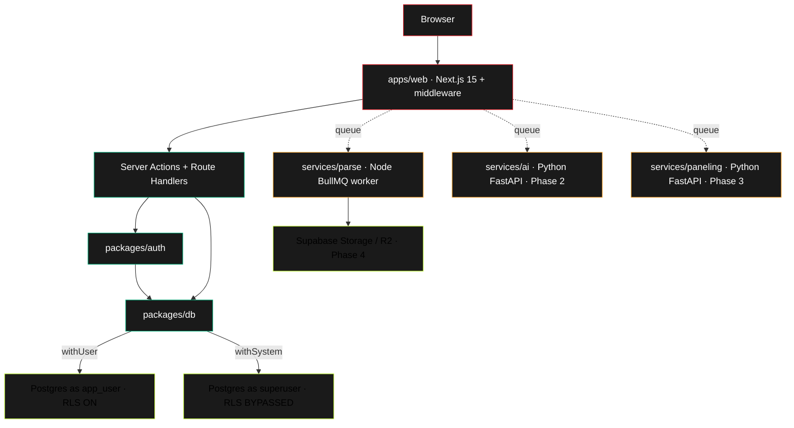

> [!tip] Templater enabled
> Press `Cmd+T` (or command palette → "Templater: Insert template") to create a new ADR, PR review, daily note, open question, or session handoff. Templates live in `_templates/`. See [[70-quick-reference]] for the daily commands.

> [!note] Two AI augmentation surfaces in `.claude/`
>
> - `.claude/skills/` — domain skills (per-task expertise) auto-activated by description match. Invoke by name in the "Skills to activate" block of any Claude Code prompt.
> - `.claude/agents/` — coordination agents (cross-task orchestrators). Currently: `context-manager` — use when designing distributed state (BullMQ job metadata, asset metadata cache, multi-agent shared context, large-scale event/error stores). Invoke by name in the same block as skills, with a clarifying note on what it should coordinate.

> [!tip] UI/UX skill stack — how they compose
> Frontend work activates **four** UI/UX skills together, each at a different layer:
>
> - **`frontend-design`** — visual decisions: layout, hierarchy, brand expression, screen composition. The "what should this look like" lens.
> - **`ui-design-system`** — design tokens: color scale, spacing, typography, finish swatches. The "what are the building-block values" lens.
> - **`ui-ux-pro-max`** — interaction model: micro-interactions, accessibility, focus management, error states, empty states. The "how should this feel" lens.
> - **`shadcn/ui`** — component implementation: which Radix-based primitive to compose, exact CLI install commands, accessibility primitives baked in. The "how do we build this" lens.
>
> Order of application: design (frontend-design + ui-design-system) → behaviour (ui-ux-pro-max) → implementation (shadcn/ui). When you list these in a "Skills to activate" block, put them in that order so the model layers their concerns correctly.

# Alpha Wolf Wrap Studio — Start Here

> [!info] What this file is
> The single entry point for anyone (you, future contributors, a fresh Claude Code session) joining this project. Read this first. Everything else links from here.

## In one paragraph

Alpha Wolf Wrap Studio is an AI-assisted vehicle wrap design and production platform. End customers describe what they want, pick their vehicle, upload a logo, and get a photoreal full-vehicle mockup in minutes. Wrap shops receive that same project, refine it, and export production-ready print panels with full metadata — sized, paneled, bled, and labelled for their specific printer and media. Two-sided platform (Customer + Shop) with a token-based handoff between them. Built on a proprietary vehicle template database. **Currently Phase 1 (desktop web app); mobile follows after v1 ships.**

For the full specification: [[prd]] (the 22-story PRD is the contract).

## How to use this vault

| If you want to...                             | Open                                                               |
| --------------------------------------------- | ------------------------------------------------------------------ |
| Understand the whole product                  | [[prd]]                                                            |
| Understand why the code looks the way it does | [[10-architecture-decisions]] (links to ADR-0000 through ADR-0005) |
| Get oriented before writing code              | This file → [[20-conventions]] → relevant ADRs                     |
| Spin up dev                                   | [[40-dev-workflow]]                                                |
| Add a vehicle template                        | [[50-vehicle-database-spec]] §6 (build workflow)                   |
| Run the next Claude Code session              | [[60-claude-code-playbook]]                                        |
| See what changed and why                      | `/activities.md` (repo root — append-only event log)               |
| Find an env var or command                    | [[70-quick-reference]]                                             |

The numeric prefixes are for sort order in Obsidian's file explorer. Numbering scheme: 00=index, 10=architecture, 20=conventions, 30=architecture diagrams, 40=dev workflow, 50=domain specs, 60=playbooks, 70=quick-ref, 80=retros, 90=open questions.

## Project at a glance

|                     |                                                                                                                                                                                                                                        |
| ------------------- | -------------------------------------------------------------------------------------------------------------------------------------------------------------------------------------------------------------------------------------- |
| **Phase**           | Phase 1 — desktop web app (5 of 8 stories through Phase 1)                                                                                                                                                                             |
| **Stack**           | Next.js 15 + React 19 + Tailwind v4 + shadcn/ui · Node + Express 5 · Postgres on Supabase · Python FastAPI services (AI, paneling) · Node parse worker · BullMQ + Upstash Redis · Auth.js v5 (JWT sessions) · Prisma · @node-rs/argon2 |
| **Hosting plan**    | Vercel (web) · Fly.io (api + python services) · Supabase (Postgres + Storage) · Cloudflare (CDN + WAF)                                                                                                                                 |
| **AI**              | Hybrid: Claude Sonnet 4.6 for orchestration + Flux/Higgsfield for image generation (via OpenRouter). Not wired yet — Phase 2.                                                                                                          |
| **Monorepo**        | pnpm workspaces + Turborepo · 4 apps, 3 services, 4 packages                                                                                                                                                                           |
| **Test discipline** | Vitest unit + integration (separate project) · Playwright E2E · pre-commit (prettier+eslint+typecheck) · CI (branch protection enforced: Node + Python ai + Python paneling must be green)                                             |
| **Repo**            | `archerverified/alphawolfedecals-app`                                                                                                                                                                                                  |

## Current state (as of 2026-05-20)


**Shipped to `main`:**

- ✓ Monorepo skeleton with pnpm + Turborepo + CI
- ✓ Auth: customer signup, shop signup with org, OTP verification, session hardening (argon2id, httpOnly cookies, CSRF, rate-limit/lockout)
- ✓ Sign-in flow (added in PR #37 — closes the Phase 1 gap)
- ✓ RLS actually enforces in dev (two-connection split: `withUser` → `app_user`, `withSystem` → superuser)
- ✓ Vehicle template system: schema, RLS policies, admin CRUD, customer browse/select, request-this-vehicle loop, SVG validator
- ✓ Migration history introduced (Prisma migrate, baselined `0_init`)
- ✓ Asset upload pipeline + base canvas editor (GH-005 + GH-008) — Supabase Storage, BullMQ/Upstash, rembg, Konva/react-konva, autosave, undo/redo
- ✓ Observability: PostHog (services/ai) + Sentry (all runtimes) with PII scrubber
- ✓ Production deploy infrastructure (Step 6): ADR-0012, render.yaml, Vercel config, security headers, rate limiting, health endpoint

**Next:** First Vercel deploy (Archer connects repo in Vercel dashboard). See [[60-claude-code-playbook]] §6 and `/docs/deployment/`.

**Phase 2+ deferred:** AI generation, print paneling, export, customer approval portal, installer mode, material estimator, mobile (React Native).

## Architecture — the 30-second mental model



The two-connection database split is the most non-obvious architectural choice and the source of most bugs that would otherwise hit production: see [[10-architecture-decisions]] → ADR-0002.

## Top 5 things to know before you touch the code

> [!warning] If you remember nothing else
> These are the patterns whose violation has caused real bugs in this codebase. Internalize them before writing code.

1. **`withUser` vs `withSystem`** in `packages/db`. Authenticated paths use `withUser(userId, fn)` — runs as `app_user` so RLS enforces. Bootstrap paths (signup, OTP, login before authentication) use `withSystem(fn)` — runs as superuser, bypasses RLS. Pick the wrong one and you'll either leak cross-tenant data or hit a "row not found" you can't explain. See ADR-0002.

2. **Raw SQL with parameters MUST use `$executeRawUnsafe` + `pgQuoteLiteral` helper.** Never `$executeRaw` tagged template. The Supabase transaction pooler at port 6543 releases connections back to the pool after each transaction, so prepared statements (which `$executeRaw` creates) collide as `s0 already exists`. See `packages/db/src/client.ts` comment on `applySessionConfig` and ADR-0004.

3. **Native modules in `apps/web` need both `serverExternalPackages` AND a webpack externals regex.** The documented `serverExternalPackages` Next.js 15 setting doesn't reach the `(action-browser)` bundling context. See `apps/web/next.config.ts` for the pattern. Examples: `@node-rs/argon2`, `svgo`. Use N-API packages (`@node-rs/*`) over `node-gyp-build`-based natives.

4. **`@alphawolf/auth` has a split entry point.** `import from '@alphawolf/auth'` is client-safe (constants + pure functions only). `import from '@alphawolf/auth/server'` is server-only (argon2, node:crypto, Prisma, Auth.js). Importing server symbols from `@alphawolf/auth` directly will pull native modules into the client bundle.

5. **Test mocks lie at framework boundaries.** Unit tests with mocked `next/headers`, mocked Prisma, or mocked `argon2` pass while real behavior breaks. The single biggest lesson of Phase 1: ship Playwright tests for any flow that crosses the client/server/database boundaries.

## Key decisions (ADRs at a glance)

| ADR  | Decision                                                                                                                                              | Why                                                                         |
| ---- | ----------------------------------------------------------------------------------------------------------------------------------------------------- | --------------------------------------------------------------------------- |
| 0000 | Record decisions using MADR                                                                                                                           | Decisions decay; markdown ADRs in repo don't                                |
| 0001 | Lock v1 stack (Next.js 15 + Node + Postgres + Python AI service)                                                                                      | Avoid drift across PRs                                                      |
| 0002 | Monorepo + CI + Auth.js + RLS-via-session-var + Express + BullMQ + Upstash                                                                            | Stack details once, never re-derive                                         |
| 0003 | `services/parse` is a Node worker, not Python                                                                                                         | Sharp + svgo + Inkscape CLI are native in Node; amends ADR-0001             |
| 0004 | Auth Phase 1 non-obvious choices (pgcrypto key via session GUC, Postgres-backed rate limits, in-memory pending shop data, dev OTP peek, JWT sessions) | Cryptographic key never crosses wire as parameter; defer Upstash            |
| 0005 | `users.is_admin` boolean (over enum or table)                                                                                                         | Simplest for v1; refactor path is clear                                     |
| 0006 | Canvas editor data model (flat elements map, panel-local coords, 50-step undo)                                                                        | Framework-agnostic core; coordinate system stays pure-TS                    |
| 0007 | Supabase Storage strategy (two buckets, app-layer auth, server-minted signed URLs)                                                                    | Custom auth can't use Supabase auth.uid() for storage RLS                   |
| 0009 | Parse queue (BullMQ/Upstash TCP; inline fallback when REDIS_URL absent)                                                                               | CI/dev works without Redis; production uses real queue                      |
| 0012 | Production deployment topology (Vercel sfo1 + Render Oregon + existing Supabase/Upstash)                                                              | Zero cost at Phase 1 scale; Oregon-aligned latency; instant Vercel rollback |

Full ADRs live in [[10-architecture-decisions]] (which links into `/docs/adr/`).

## Critical learnings from Phase 1 (don't relearn these the hard way)

Lessons earned by shipping eight bugs in PR #34 alone, all surfaced by live testing:

- **Argon2 native binding** — use `@node-rs/argon2` (Rust + N-API, version-agnostic). The `argon2` package's prebuilds don't cover newer Node ABIs reliably. Drop `algorithm: Algorithm.Argon2id` from options to avoid TS2748 const-enum errors under `isolatedModules`. Argon2id is the default.
- **CSRF cookie writes** — Next.js 15 Server Components can READ cookies but not WRITE them. Bootstrap CSRF cookies in `apps/web/middleware.ts`, then read them in Server Components.
- **Edge runtime crypto** — middleware runs in Edge runtime. Use Web Crypto API (`crypto.getRandomValues`) inline, not `node:crypto`.
- **Webpack `.node` files** — `serverExternalPackages` alone doesn't reach Server Actions. Add a webpack externals regex too. Belt + suspenders.
- **`next-env.d.ts`** — auto-generated, must be committed, must be ESLint-ignored. Already handled in `eslint.config.mjs`.
- **`pnpm install` after branch switches** — `node_modules` doesn't auto-sync with `package.json` across branches.
- **`.env.local` updates after rotating `app_user` password** — three separate URLs (DATABASE_URL, DATABASE_URL_APP, DIRECT_URL), two distinct passwords. See [[70-quick-reference]].
- **GitHub Actions check names** — branch protection's required-status-check contexts must match `jobs.<id>.name` from `ci.yml` byte-for-byte. No workflow prefix, no event suffix. Em-dashes are em-dashes.
- **CI must run `prisma generate`** — schema lives at a non-default path so the @prisma/client install hook ships only the stub.
- **`pgcrypto` search_path** — pin `SET search_path = public, pg_catalog` on encrypt/decrypt helper functions so they're resilient to caller search_path.
- **`dev-otp` ring buffer** — Server Actions and Route Handlers get separate module instances in Next.js dev. Module-level state needs `globalThis` to be truly process-global.
- **Third-party observability bypasses the encryption boundary unless every init scrubs.** Sentry's `sendDefaultPii: true` ships cookies, `Authorization` headers, IPs, and user emails to a vendor in plaintext — defeating the pgcrypto/PII layer. Never `sendDefaultPii: true`; every `Sentry.init` must set `sendDefaultPii: false` and `beforeSend: scrubSentryEvent` (`@alphawolf/observability`). An ESLint guard enforces both. See [[70-quick-reference]] (Observability) and ADR-0011.
- **Vercel `pdx1` (Portland) is NOT a generally available compute region on Hobby tier.** Pin to `sfo1` (San Francisco) — the closest available Vercel region to Oregon services (Supabase `aws-1-us-west-1`, Upstash `aws-us-west-2`, Render Oregon). Attempting `pdx1` silently falls back to `iad1` (Virginia), adding 60-80ms round-trip to all DB/queue calls. See ADR-0012.
- **`connection_limit=1` in the pgBouncer DATABASE_URL is correct and must not be raised.** Each Vercel serverless function instance is isolated; raising the limit multiplies connection count under load (50 concurrent instances × 3 = 150 pgBouncer connections vs 50). The `?pgbouncer=true` flag already eliminates the most expensive part of connection setup (prepared statement cache). See ADR-0012 §Vercel.

## Development workflow

```
1. Branch from main: git checkout -b <type>/<short-name>
2. Make changes; pre-commit hook runs prettier + eslint + typecheck
3. Push; CI runs (Node + Python ai + Python paneling — all 3 required)
4. Open PR; branch protection blocks merge until all 3 are green
5. Squash merge to main; delete feature branch
6. git checkout main && git pull
7. Update activities.md with a new top entry (decisions made, scope deviations, followups)
```

Conventional commits enforced (commitlint). Branch types: `feat/`, `fix/`, `infra/`, `chore/`, `docs/`.

See [[40-dev-workflow]] for the full workflow including `pnpm install` discipline, env-file management, and the [[60-claude-code-playbook]] for AI-assisted sessions.

## How Claude Code sessions are run

Each Step in the playbook is one PR, one Claude Code session. See [[60-claude-code-playbook]]. Pattern:

1. Open fresh Claude Code session in the repo (don't reuse — context decays)
2. Paste the relevant Step prompt verbatim (from `/docs/claude-code-prompts.md`)
3. Answer its clarifying questions, then let it work
4. Review the PR with senior-architect + code-reviewer lenses
5. Verify locally if uncertain (Playwright + manual via dev server)
6. Merge when CI is green
7. Pull main, log learnings in `/activities.md`, move to next step

## Open questions and Phase 4 follow-ons

|                                                       |                                                                                                                                                          |
| ----------------------------------------------------- | -------------------------------------------------------------------------------------------------------------------------------------------------------- |
| Fail-closed `DATABASE_URL_APP` fallback in production | Currently warns; should `throw` when `NODE_ENV=production`. Three-line fix before Phase 4 deploy.                                                        |
| ESLint rule restricting `withSystem` imports          | Only `@alphawolf/db` and `@alphawolf/auth` should be allowed to import `withSystem`. Mirrors the `@prisma/client` restricted-import pattern.             |
| Replace local asset store with real blob storage      | PR #37's local store is a deploy footgun. Will be replaced in GH-005 with Supabase Storage or R2. Until then, never deploy with uploaded SVGs in flight. |
| Vehicle DB spec drift                                 | PR #37 added trigram index for typo tolerance beyond §2's tsvector-only spec. Update `docs/vehicle-database-spec.md` to reflect.                         |
| `thumb_png_url` column name vs SVG content            | Stopgap stores SVG URL in column named for PNG. Either rename to `thumbnail_url` (cheap) or rename in GH-005 when PNG thumbnails ship.                   |
| `printable_area_mm2` default of 0                     | Cross-PR coupling with GH-010 (print paneling). Document loudly or add a `CHECK (printable_area_mm2 > 0)` once GH-005 fills it.                          |
| Resend domain verification                            | Sandbox sender only delivers to `archer@1stimpression.co`. Verify `alphawolfwrap.com` before Phase 4 launch; lift dev-otp peek to legacy.                |
| Production secret management                          | Currently `.env.local` only. Vercel + Fly.io secrets to provision in Step 6.                                                                             |

See [[90-open-questions]] for the full list with rationale.

## Files in this vault

```dataview
TABLE WITHOUT ID file.link AS Note, type, last_updated
FROM "vault"
SORT file.name ASC
```

(Replace this Dataview query with a static list if the Dataview plugin isn't installed.)

### Subdirectories (added in Goal 0, 2026-05-25)

The autonomous /goal chain (Goals 1-4) writes its closeout artifacts into two vault subdirectories:

- **`sessions/`** — one Markdown handoff per goal, named `<date>-goal-N-topic.md`, created from `_templates/Session-handoff.md`. The narrative "what shipped / what's in flight / what the next session needs" log for each autonomous run. Start: [[2026-05-25-goal-0-foundation-setup]].
- **`diagrams/`** — one Mermaid diagram per goal, named `goal-N-*.md` (C4-context, sequence, flowchart, or state-machine depending on what the goal shipped). Start: [[goal-0-foundation-state]] (C4-context of the system at the start of the chain).

Foundation/setup artifacts (not in the vault) live under `/docs/setup/` — branch-protection payload, MCP smoke checklist, manual steps, and Figma file URLs. See [[../setup/manual-steps]].

## Conventions in this vault

- **Filenames** use kebab-case with numeric prefixes for sort order
- **Headings** use sentence case
- **Wikilinks** use `[[file-name]]` (Obsidian double-bracket) — file name without extension
- **Tags** in YAML frontmatter, not body
- **Callouts** use Obsidian's `> [!type]` syntax (`info`, `warning`, `tip`, `danger`, `note`)
- **Code blocks** specify language for syntax highlighting (`bash`, `typescript`, `sql`, etc.)
- **Mermaid diagrams** use the standard ` ```mermaid ` fence
- **Status frontmatter** uses lowercase: `draft`, `current`, `superseded`, `archived`

## When to update this file

| Trigger                       | What to update                                        |
| ----------------------------- | ----------------------------------------------------- |
| New step shipped              | "Current state" section + the Mermaid milestone chart |
| New ADR written               | "Key decisions" table                                 |
| New cross-cutting bug pattern | "Critical learnings" list                             |
| Vault structure changes       | "Files in this vault" + the numeric prefix scheme     |
| Phase 4 followup discharged   | "Open questions" section                              |
| Stack change                  | "Project at a glance" stack row                       |

Bump the `last_updated` field in the frontmatter every time.

## Cross-references

- [[prd]] — full PRD (`/prd.md`)
- [[10-architecture-decisions]] — ADR index
- [[20-conventions]] — code & naming conventions
- [[30-architecture-diagrams]] — system topology, data model, request flow
- [[40-dev-workflow]] — daily development loop
- [[50-vehicle-database-spec]] — vehicle DB schema and build workflow
- [[60-claude-code-playbook]] — sequential prompts for Claude Code sessions
- [[70-quick-reference]] — env vars, commands, where things live
- [[80-phase-1-retrospective]] — what worked, what didn't (write this at end of Phase 1)
- [[90-open-questions]] — Phase 4 followups, deferred decisions

External:

- Live app (dev): `http://localhost:3000`
- Repo: https://github.com/archerverified/alphawolfedecals-app
- Activities log (in repo): `/activities.md` — append-only event log
- ADRs (in repo): `/docs/adr/`
- Marketing site: alpha-wolf-decals.vercel.app
