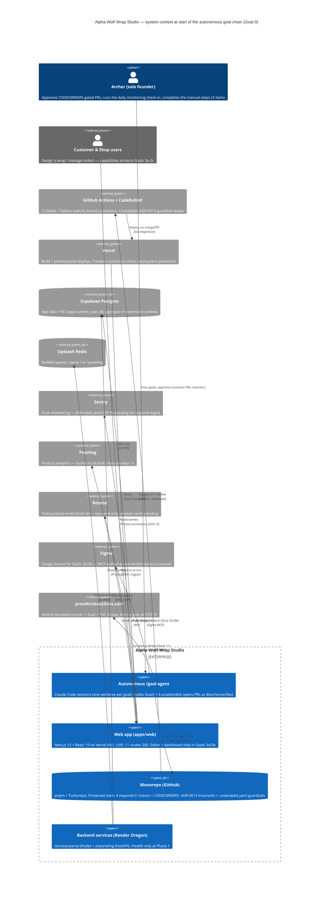

# Goal 0 — foundation state (C4 context)

System-context view of Alpha Wolf Wrap Studio **at the moment the autonomous `/goal`
chain begins**: the operator, the deployed system + repo, every connected service Goal 0
verified, and the build-loop the foundation enables. Solid blue = the system under build;
grey = external platforms. Created at Goal 0 closeout (STEP B).

## What this diagram asserts (Goal 0 closeout)

- **Protected path:** `agent → repo → GitHub CI → Vercel → web` is the merge-to-deploy pipeline the foundation guards. The hard gates are the **4 required CI checks** + **CodeRabbit's ADR-0013 guardrails**; CODEOWNERS is a _soft_ gate (see `manual-steps.md`).
- **Verified reachable in Goal 0:** GitHub, Vercel, Supabase, Sentry, PostHog, Resend, Figma (10 PASS / 1 FAIL — Control Chrome is desktop-only). See `mcp-smoke-checklist.md`.
- **Not yet built (arrives later in the chain):** the editor + dashboard surfaces of `web` (Goals 3a/3b), email dispatch via Resend (Goal 3c), and the vehicle catalog fed by the `provehicleoutlines.com` scrape (Goals 1-2, behind the STEP D license gate).
