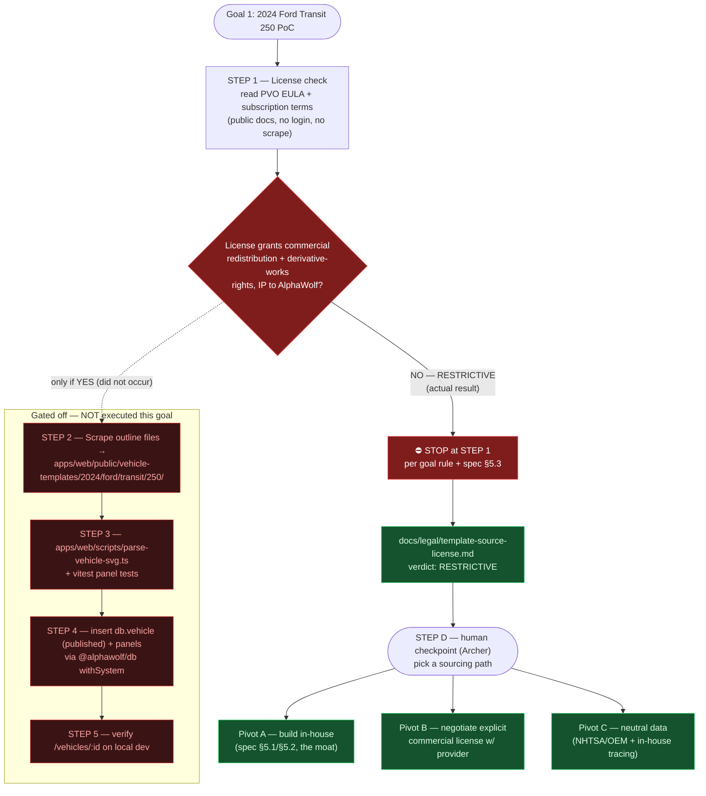

# Goal 1 PoC pipeline — scrape → parse → insert → verify (gated at STEP 1)

The intended PoC pipeline is scrape → parse → insert → verify. Goal 1 **halted at the
license gate (STEP 1)**: the Pro Vehicle Outlines EULA is RESTRICTIVE, so STEPs 2–5 were
**not executed**. The diagram shows the gate firing and the downstream steps gated off.

**Legend** — red: the gate and the stop. dark-red: steps gated off (never ran). green: what
actually shipped (the license doc) and the pivot options for the human checkpoint.
