# Goal 10 — Launch Hardening (the go-live gate)

Autonomous single run, 2026-06-14. PR #170. All D0–D8 shipped; **LAUNCH = NO-GO**
(security + ops GREEN; 3 functional blockers). See
[`../../deployment/launch-checklist.md`](../../deployment/launch-checklist.md).

```mermaid
flowchart TD
    subgraph CLEAN["D0 — DB cleanup ✅"]
        D0["Retire 14 stale @alphawolf.test + 7 orphan shops<br/>(guarded --keep + --max, manual CLI)<br/>17→3 users · 8→1 shop · 0 admins<br/>keep @alphawolf.test OUT of cron RETIRE"]
    end

    subgraph GATES["BLOCKING GATES"]
        D1["D1 Security ✅ PASS<br/>RLS deny-all: rate_limits + _prisma_migrations<br/>transfer_token = share-view only (GH-012 test)<br/>CSP/headers/secrets clean · indep audit: no crit/high"]
        D2["D2 Prod-readiness 🟡 ops GREEN<br/>deploy READY + rollback runbook<br/>backup-restore drill PASS · env complete<br/>404-quirk root-caused · error boundaries added<br/>⛔ forgot-password · ⛔ catalogue panels"]
    end

    subgraph HARDEN["Hardening + launch prep"]
        D3["D3 Anti-abuse ✅<br/>referral disposable + IP-ring block<br/>daily global spend-cap monitor"]
        D4["D4 Legal 🔶<br/>footer reachability ✅<br/>Terms/Privacy = [[PLACEHOLDER]] (Archer)"]
        D5["D5 Perf ✅<br/>no regression · CLS 0<br/>LCP cold-start-bound"]
        D6["D6 SEO ✅<br/>robots gated flip + AI-crawler deny<br/>sitemap + canonical + OG/Twitter"]
        D7["D7 Investor + go/no-go checklist ✅"]
    end

    subgraph VERIFY["D8 — Shakedown ✅ (net-zero local)"]
        D8["webapp-testing: 9 pages · axe WCAG-2.2-AA = 0<br/>custom 404 + footer nav + robots/sitemap<br/>full design→export covered by Goal-7 proof + e2e"]
    end

    D0 --> D1 --> D2
    D2 --> D3 --> D4 --> D5 --> D6 --> D7 --> D8
    D8 --> CALL{"Launch go/no-go"}

    CALL -->|⛔ blockers| BLK["1. Terms + Privacy copy (Archer)<br/>2. Forgot-password flow<br/>3. Catalogue-template panels (Goal-8)"]
    BLK --> FLIP["Launch step:<br/>APP_ALLOW_INDEXING=true → redeploy<br/>→ smoke → /health SHA → GO"]

    classDef pass fill:#dcfce7,stroke:#16a34a,color:#14532d;
    classDef warn fill:#fef9c3,stroke:#ca8a04,color:#713f12;
    classDef block fill:#fee2e2,stroke:#dc2626,color:#7f1d1d;
    class D0,D1,D3,D5,D6,D7,D8 pass;
    class D2,D4 warn;
    class BLK,CALL block;
```

## Flow of the gate

1. **D0** cleans the DB to a known-good 3-account baseline.
2. **D1** (security) + **D2** (prod-readiness) are the blocking gates — D1 PASS; D2 ops
   GREEN but surfaces 2 functional blockers.
3. **D3–D7** harden anti-abuse + spend, scaffold legal, re-baseline perf, ship the SEO
   launch posture (gated), and produce the go/no-go checklist + investor refresh.
4. **D8** verifies the launch surface net-zero (axe-clean, pages render, Goal-10 changes
   work); the storage/AI flow is covered by Goal-7's prod proof.
5. **Launch** is one `APP_ALLOW_INDEXING` flip away once the 3 blockers clear.
