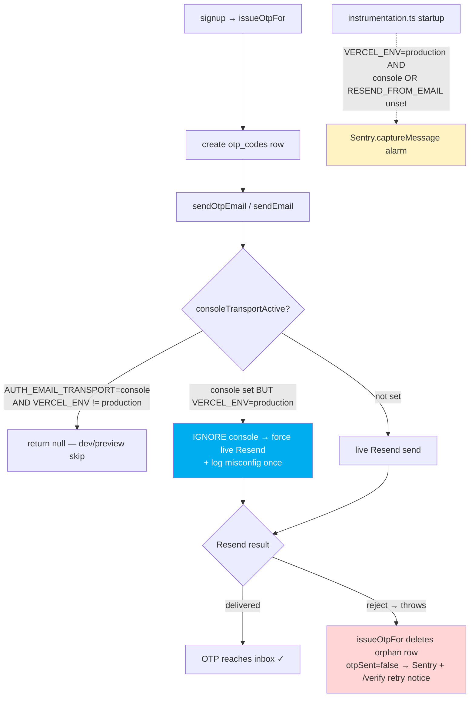
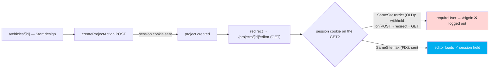

# Goal 11 — Pre-Launch Cleanup

Pre-launch cleanup so the live customer journey is testable end-to-end. Headline
fix: OTP email could no longer be silently dropped. Shipped 2026-06-15 across
PRs #171 (D1), #172 (D2), #173 (D4), #174 (D6); D3/D5/D7 needed no app code.

## D1 — Email-delivery backstop (the silent OTP drop, made un-break-able)

The old break: `console` was left set in prod → `C` returned `null` silently (no
send, no error), the row persisted, `otpSent` stayed true → user waited on a code
that never sent. The guard `F` makes that impossible in real production.

## D2 — Editor-entry logout (session cookie SameSite)

## D4/D5/D6/D7 — supporting fixes

```mermaid
flowchart TD
    subgraph D4[D4 — prod smoke]
      S1[brief-wizard test body<br/>cold-prod uploads] --> S2[afterEach self-clean]
      S2 -->|"OLD: shared 300s budget exhausted"| S3[afterEach TIMEOUT ❌]
      S2 -->|"FIX: test.setTimeout(+120s)"| S4[teardown completes ✓]
    end
    subgraph D6[D6 — deps]
      R1[bullmq 5.78 pins ioredis 5.10.1] --> R2[app ioredis 5.11.1 → 2 copies → TS2322]
      R2 -->|"FIX: pnpm.overrides ioredis 5.11.1"| R3[single ioredis → typecheck green ✓]
    end
    subgraph D5[D5 — Sentry NODE-B]
      N1["/signin 'unexpected response' (client)"] -->|"transient, last 06-14;<br/>strict-cookie cause fixed by D2"| N2[resolved-with-reason ✓]
    end
    subgraph D7[D7 — monitoring]
      H1["/health 200 — liveness (no DB)"]
      H2["/vehicles 200 — DB-readiness probe"]
    end

    style S4 fill:#00AEEF,color:#fff
    style R3 fill:#00AEEF,color:#fff
    style N2 fill:#00AEEF,color:#fff
```

## Deliverable status

| D   | What                      | Outcome                                                             |
| --- | ------------------------- | ------------------------------------------------------------------- |
| D1  | Email-delivery backstop   | Code guard + startup alarm + regression tests + env-matrix truth-up |
| D2  | Editor-entry logout       | Session + csrf cookies `strict`→`lax` + regression test             |
| D3  | Forgot-password dead-end  | None exists — confirmed (no link in the app); launch-without        |
| D4  | Green the prod smoke      | Teardown gets its own timeout budget (all 3 specs)                  |
| D5  | Sentry `/signin` (NODE-B) | Resolved-with-reason; confirmed unrelated to D1                     |
| D6  | Dependabot #162           | 22-pkg group merged; ioredis deduped (override); supersedes #162    |
| D7  | `/health` monitoring      | `/health` 200 verified; `/vehicles` = DB-readiness probe (decision) |
| D8  | Verification              | Unit/integration green; prod smoke green; coverage notes committed  |
