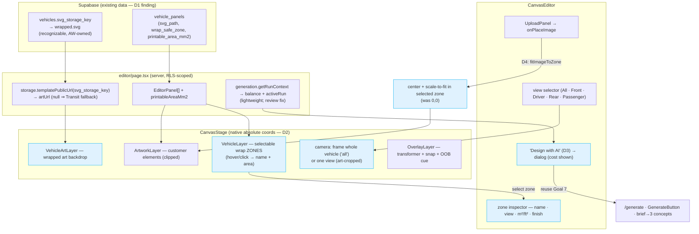

# Goal 12 — Design Editor Overhaul (architecture)

How the editor went from abstract panel boxes to a real wrap-design surface. The
key realization: the AW-owned `wrapped.svg` artwork and the `vehicle_panels`
geometry share ONE coordinate space, so the editor renders the art as a backdrop
with the panels as selectable zones on top — no AI generation required.

**Deliverables:** D1 (art already existed → evidenced report, $0 spend) · D2 (art
backdrop + native coords + camera + selectable zones) · D3 (in-editor AI entry,
reuses Goal 7) · D4 (logo snaps to zone) · D5 (axe-clean, design grade F→A−).
