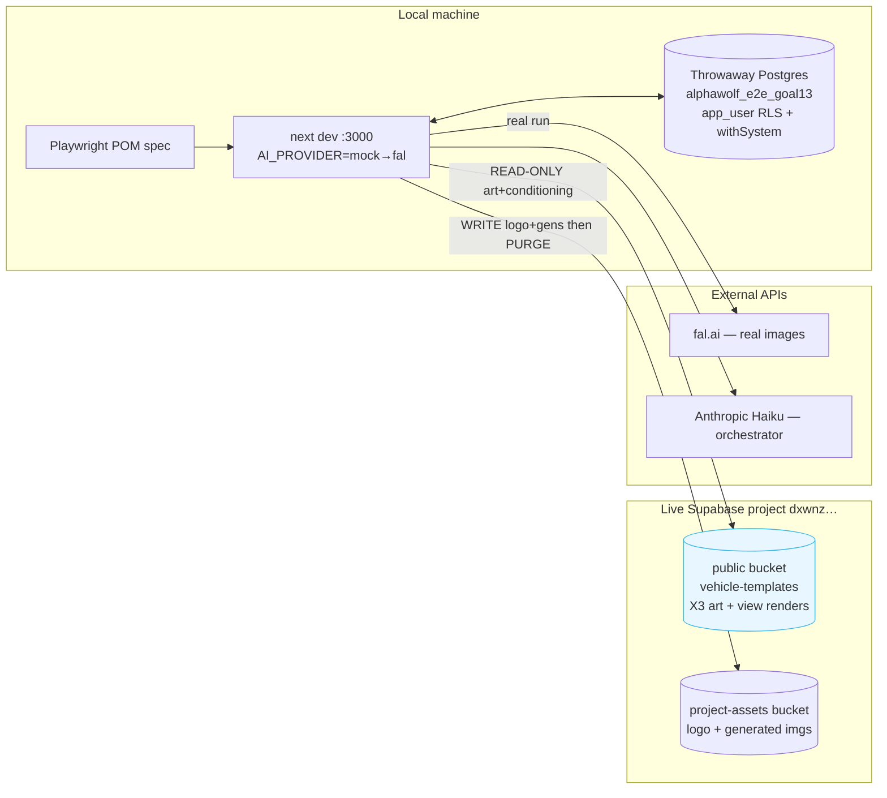

# Goal 13 — Full E2E Acceptance Test (diagram)

The full B2C customer journey driven end-to-end against a **real build**, with the
durable spec on the **mock** provider (CI-safe, reproduced ≥3×) and the headline
**export proven once on real fal**. Net-zero: throwaway local DB + scoped live-storage purge.

## Journey + assertions

```mermaid
flowchart TD
  A[Landing /] --> B[Sign up — dev-OTP]
  B --> C[Verify OTP] --> D[/welcome/]
  D --> E[Catalogue /vehicles/select]
  E --> F[BMW X3 detail → Start project]
  F --> G[Editor empty]
  G --> H{Brief wizard — 11 steps}
  H --> H1[zones] --> H2[photos*] --> H3[logo: alpha-wolf-logo.svg] --> H4[colors #000/#FFF/#35B6E8]
  H4 --> H5[style: Aggressive] --> H6[zone notes] --> H7[materials] --> H8[tint+legality] --> H9[extras] --> H10[AI notes] --> H11[review: credit cost]
  H11 --> I[Generate — 1 credit]
  I --> J[3 concepts: literal/bolder/minimal]
  J --> K[Iterate once — 1 credit]
  K --> L[Select winner → free final]
  L --> M[Editor: recognizable X3 art + locked AI layers + composited logo]
  M --> N[Select wrap zone → name+area]
  N --> O[In-editor Design-with-AI]
  O --> P[[Export spec-pack PDF: %PDF- + spec table + AI cover + composited logo]]
  P --> Q[afterEach: cleanupCreatedProjects — soft-delete via real owner UI]

  classDef spend fill:#35B6E8,stroke:#000,color:#000;
  class I,J,K spend;
  classDef proof fill:#000,stroke:#35B6E8,color:#fff;
  class P proof;
```

\* photos = optional/best-effort (async parse worker).

## Environment / data-flow

- **DB never touches prod** — all rows live in the throwaway local Postgres.
- `vehicle-templates` (58 objects) read-only / untouched.
- `project-assets` baseline 21 → my run writes ~N objects (scoped to my project IDs) → purged back at closeout.
