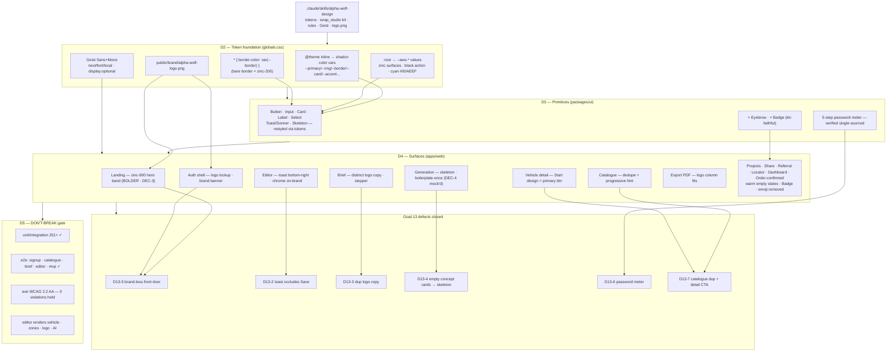

# Goal 14 — Design System Integration (diagram)

How the committed **alpha-wolf-design** system was wired across the Wrap Studio app
as a **presentational-only** layer (zero behavior change). The single lever: the
shadcn primitives already referenced semantic CSS vars that were never defined —
defining them (mapped to `--aws-*`) restyled every primitive with no component change.

**Posture:** surgical/visual-only by default; two bolder calls flagged for Archer's
sign-off — the landing `zinc-900` inverse hero band (DEC-3) and the generation
featured-concept layout (DEC-4, mockup-only this pass; the populated grid can't
render under the local mock provider, so the safe slop-fixes shipped and the
featured reflow is greenlight-pending).

**Hard line held:** no Konva/canvas/render/zones logic, no server actions/auth/RLS,
no export computation, no third color, no emoji, no invented radii — all touched
files are Tailwind classes / copy / markup-for-styling with identical component APIs.
