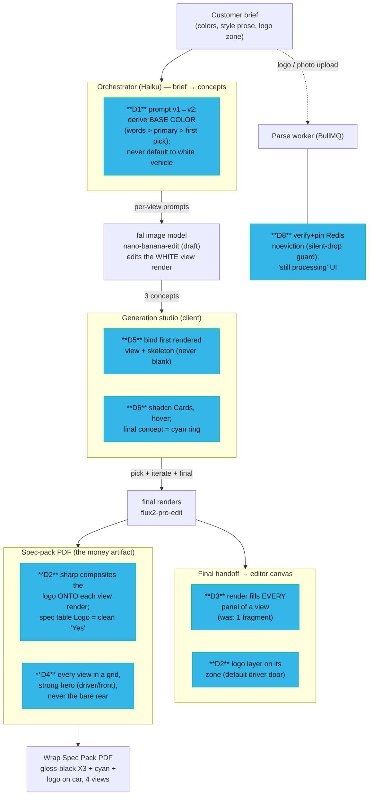

# Goal 15 — Generation & Export Correctness

The core value chain (brief → AI → export) and where each deliverable landed.
The export IS the product: a brief must produce a recognizably-that design, with
the customer's logo ON the vehicle, across multiple views.

## Root cause (D1) — proven, not guessed

`systematic-debugging` overturned the prompt's hypothesis ("nano-banana-edit too
conservative"). On real fal the image model is **faithful** — a black-base prompt
renders a black car, a white-base prompt renders a white car. Goal-13 came back
WHITE because the **orchestrator had no base-color contract**: an unroled palette
containing white + a white conditioning vehicle + a "partial wrap / select panels"
framing led Haiku to default to a white base. The fix foregrounds an explicit,
deterministic base color so the customer's intent governs every concept.

## Proof (D9)

`docs/deployment/screenshots/2026-06-16-goal-15/goal-15-export-pack.pdf` — the
before/after vs the Goal-13 white-car export, produced by a vertical slice through
the real code on real fal (net-zero: no DB / live-storage writes).
