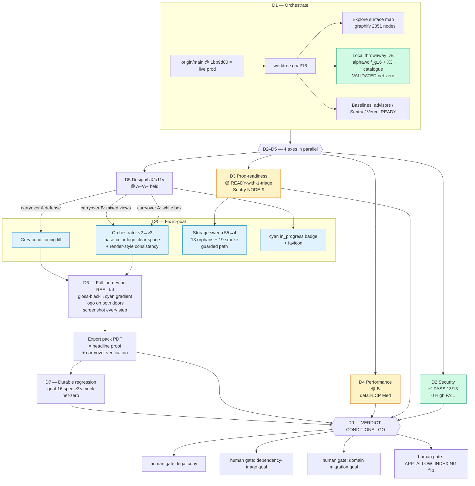

# Goal 16 — Launch-Readiness Audit (the go/no-go gate)

The whole product audited across every axis in parallel, fixed in-goal, and converged into one GO/NO-GO verdict.

**Net-zero:** prod DB never written (local throwaway only); `project-assets` 55→4 (leak purged, `vehicle-templates` 58 untouched); advisors 0 net-new; Sentry 0 new.
