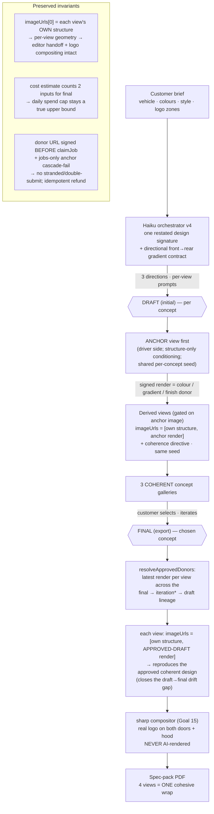

# Goal 17 — Cross-View Coherence

How the AI wrap is made to read as ONE cohesive design across all four export views
(the fix for Goal-16 carryover B, where the views disagreed on base colour).

## Root cause → fix

Goal-16: each view was an **independent img2img call** (per-view seed, only its own
structure conditioning, no shared visual anchor) → base colour + style diverged.
v3's _text_ coherence directives provably failed on real fal. The lever is the
**conditioning layer** (a shared visual anchor), not the prompt.

## Proven (real fal, 3 briefs — battle-tested, not one-shot)

| Brief       | Design                                | Views agree?                                   |
| ----------- | ------------------------------------- | ---------------------------------------------- |
| Locked (X3) | gloss black→cyan gradient             | ✅ one gloss black+cyan gradient on every view |
| Eval B (X3) | solid deep-red + white racing stripes | ✅ same red base + white stripes, both sides   |
| Eval C (X3) | grey→purple gradient                  | ✅ one grey↔purple gradient on every view      |

**Before (Goal 16):** driver = gloss-black + cyan wireframe; passenger = solid cyan — sides disagreed on base colour.
**After (Goal 17):** every brief's four views share one base treatment; the disagreement is gone.

**Documented residual:** the gradient _direction_ (which end is darkest) is model-variable
(correct in grey→purple, reversed in black→cyan) — a refinement, not the coherence fix.
