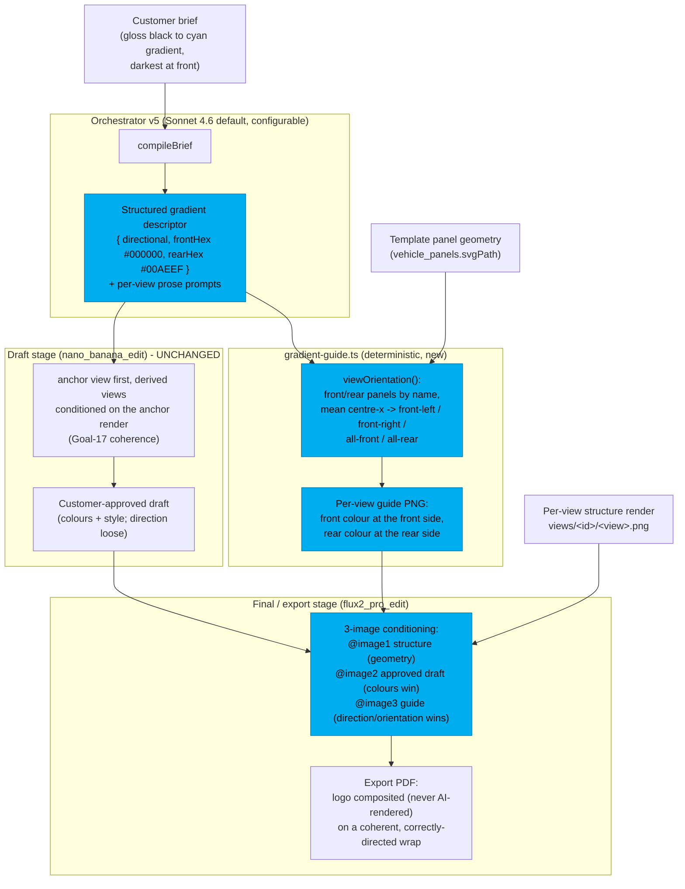

# Goal 18 - Generation Polish (gradient direction + logo-on-coherent-vehicle proof)

Two surgical fixes on the Goal-17 generation pipeline:

1. The AI image model rendered a briefed directional gradient **backwards** (model-variable).
2. The committed Goal-17 export PDFs predated the logo-sanitizer fix, so no single artifact showed the logo on a coherent vehicle.

## Root cause (systematic-debugging, proven on real fal)

The orchestrator (Haiku, then Sonnet) emits the briefed direction correctly in every per-view prompt (hex-anchored, landmarked). The **diffusion image model ignores directional text** and paints the gradient start-colour to finish-colour as left-to-right in image space. On the driver-side anchor (front on the right), "black to cyan" lands black-rear / cyan-front = reversed. The Goal-17 anchor + coherence directive then propagate that reversal to every view coherently.

Text levers (anatomical and image-space) and a guide image on the draft model (nano) all failed on real fal. Only the EXPORT model (flux2_pro_edit) reliably reproduces the left-to-right colour layout of a conditioning image.

## The deterministic fix

## What changed

- `apps/web/lib/ai/orchestrator/prompts.ts` + `index.ts`: orchestrator v4 -> v5 emits a structured `gradient` descriptor; title/summary truncation; per-attempt time budget so a slow model fits the 60s slice.
- `apps/web/lib/ai/gradient-guide.ts` (new): deterministic per-view guide builder; orientation from panel `svgPath`.
- `apps/web/lib/ai/run-pipeline.ts`: the FINAL stage conditions on `[structure, approvedDraft, guide]` for a directional concept (guide governs direction, draft governs colours); Goal-17 fallback for non-directional briefs.
- `apps/web/lib/actions/generation.ts`: cost estimate inputImages 2 -> 3 for the directional final.
- `packages/db/src/ai-config.ts`: orchestrator model configurable via `ANTHROPIC_ORCHESTRATOR_MODEL` (allowlist sonnet-4-6 / opus-4-8 / haiku-4-5, fail-fast, model-tied pricing), default `claude-sonnet-4-6` (PRD §10).

## Non-directional briefs

`gradient.directional === false` (solid colour, or unknown view orientation, or a bad hex) -> no guide is built -> the final falls back to the Goal-17 `[structure, approvedDraft]` conditioning. Coherence and the logo path are untouched.
