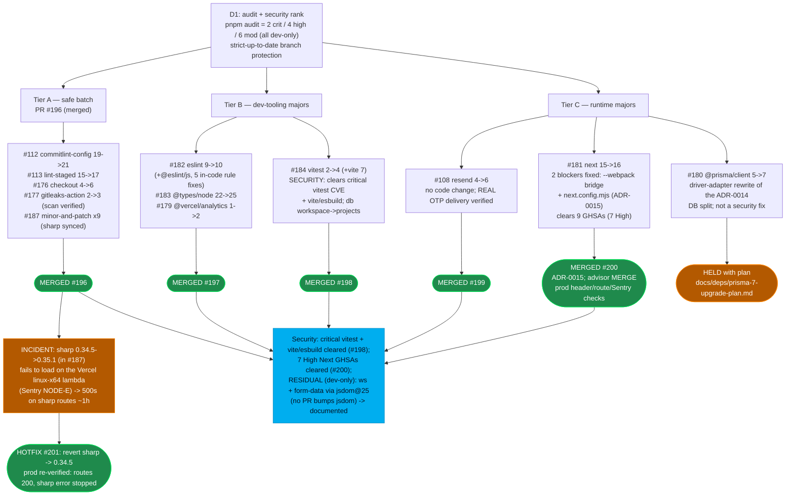

# Goal 19 — Dependency Triage (12 Dependabot PRs)

Triage of the 12 open Dependabot PRs into safe batch / dev-tooling majors / runtime
majors, with the security advisories each bump clears. 11 of 12 PRs landed across 5
consolidated PRs (#196-#200); Prisma 7 (#180) held with a documented plan.

## Outcome summary

| PR(s) | Bump | Disposition |
|---|---|---|
| #196 | Tier A: commitlint-config, lint-staged, checkout, gitleaks-action, minor-and-patch x9 | Merged (5 Dependabot PRs batched) |
| #197 | eslint 9->10 (+ 5 rule fixes), @types/node 22->25, @vercel/analytics 1->2 | Merged |
| #198 | vitest 2->4 + vite 7 (security: critical vitest CVE) | Merged |
| #199 | resend 4->6 (OTP transport; real delivery verified) | Merged |
| #200 | next 15->16 (+ --webpack bridge + .mjs config; ADR-0015) | Merged |
| #180 | @prisma/client 5->7 (driver-adapter rewrite) | **Held** with upgrade plan |

**Dependency launch-gate: cleared** for 11/12 PRs. The one hold (Prisma 7) carries no
security debt (no advisory on 5.22) and has a documented, scheduled upgrade plan.
