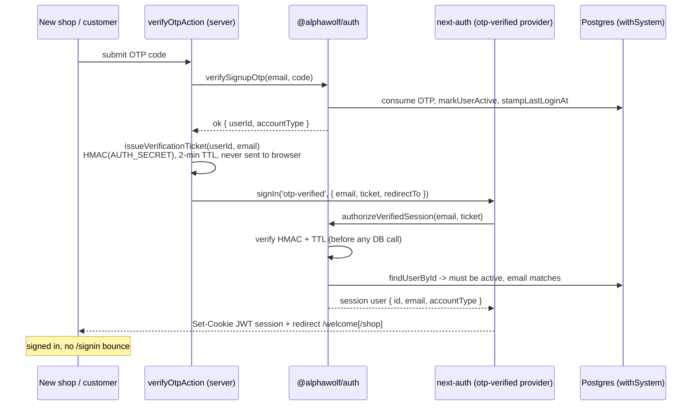
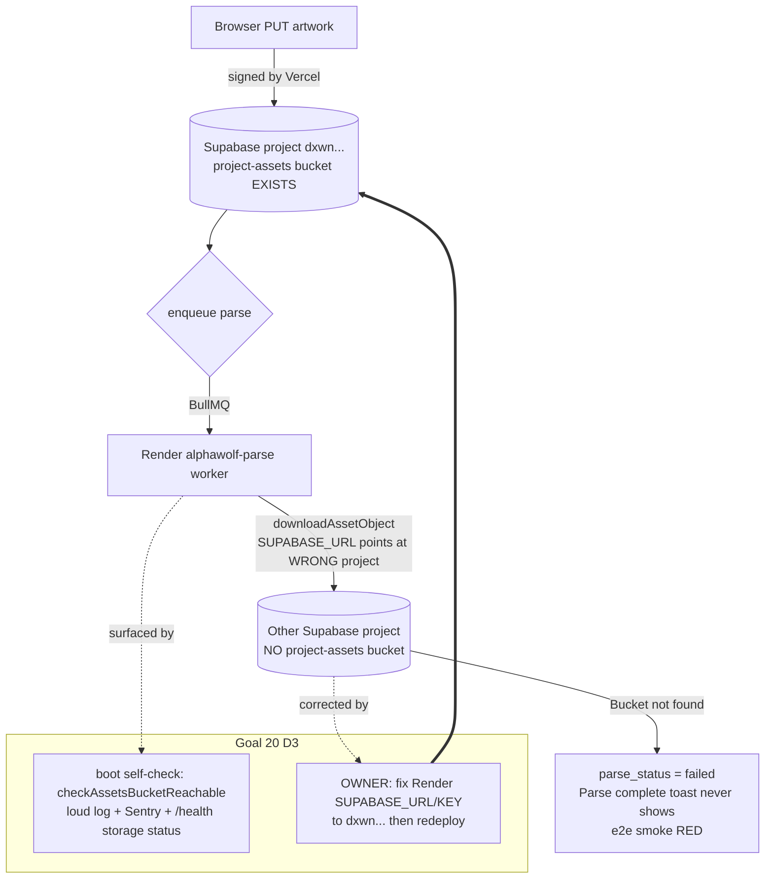

# Goal 20 fix-it: launch-blocker repairs (B2B re-triage)

Branch `goal/20-fixit` off `origin/main` 758eca8. Built 2026-06-22, reviewed x2
(section 3 + advisor), held for Archer's merge + 3 owner actions.

## D1: session-on-verify (fixes F3 + NODE-G)

Before: verify marked the account active but established no session, so the first
auth-gated action bounced the new user to /signin (and shop last_login_at stayed
null). After: the server signs the user in at verify via a short-lived HMAC
ticket that never reaches the browser.

## D3: the "Bucket not found" root cause (intermittent prod parse outage)

~60% of prod parses failed with `Bucket not found` though the bucket + objects
exist where uploads land. The upload is always signed by Vercel into project
dxwnzxlmggpdjyoxdybh; the Render parse worker reads from a DIFFERENT (wrong)
project, so its download 404s the bucket. Code change = make it loud; the env
correction is the owner step.

## D2 / D4 / D5 (one-line each)

- D2: `transitionOrderAction` now fires `dispatchOrderStatusEmail` on
  accept/complete; `/welcome/shop` links to the existing RLS-scoped `/dashboard`
  order view (orders are no longer email-only).
- D4: CSP allows `us-assets.i.posthog.com` (script + connect) and
  `us.posthog.com` (connect) so PostHog remote config + flags load. No locked
  invariant weakened.
- D5: Support repointed to the verified `support@1stimpression.co` domain.
