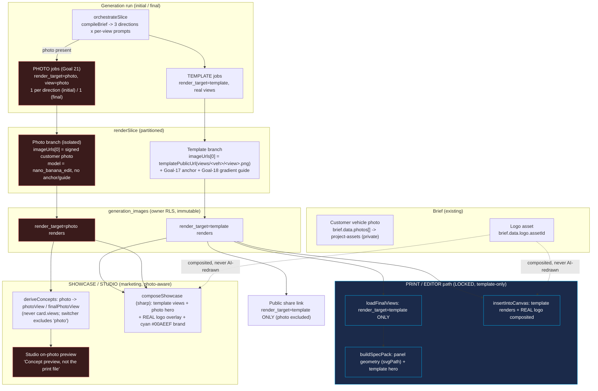

# Goal 21 - Photo-render concepts + multi-view marketing showcase

How the on-photo render path and the showcase attach to the existing pipeline, and how the
print/export path stays isolated from them.

## Invariants enforced (verified by tests + final review)

- The photo render is `render_target='photo'` / `view='photo'` and is filtered out of every
  print/editor/share read (`loadFinalViews`, `insertIntoCanvas`, public share), so the spec pack and
  the editor canvas keep deriving from template geometry only.
- The Goal-17 anchor + Goal-18 gradient-guide coherence machinery runs on template jobs only; a photo
  job never becomes an anchor and never gates a template job; template conditioning is unchanged.
- Photo jobs ride the existing run's single credit spend; the daily $5 spend cap stays a true upper
  bound (`estimateRunCostUsd` counts the photo renders).
- The real logo is composited (sharp) on the showcase + editor + export; it is never sent to the AI.
- New `render_target` column on already-RLS'd tables; no new tables/buckets/policies. All photo,
  showcase, and brief paths are owner-scoped via `withUser`.

Spend ceiling for build/verify: $10 (logged DECISION D-A). Marginal feature cost: +3 nano renders on
the initial run, +1 on the final (~$0.16 / project).
