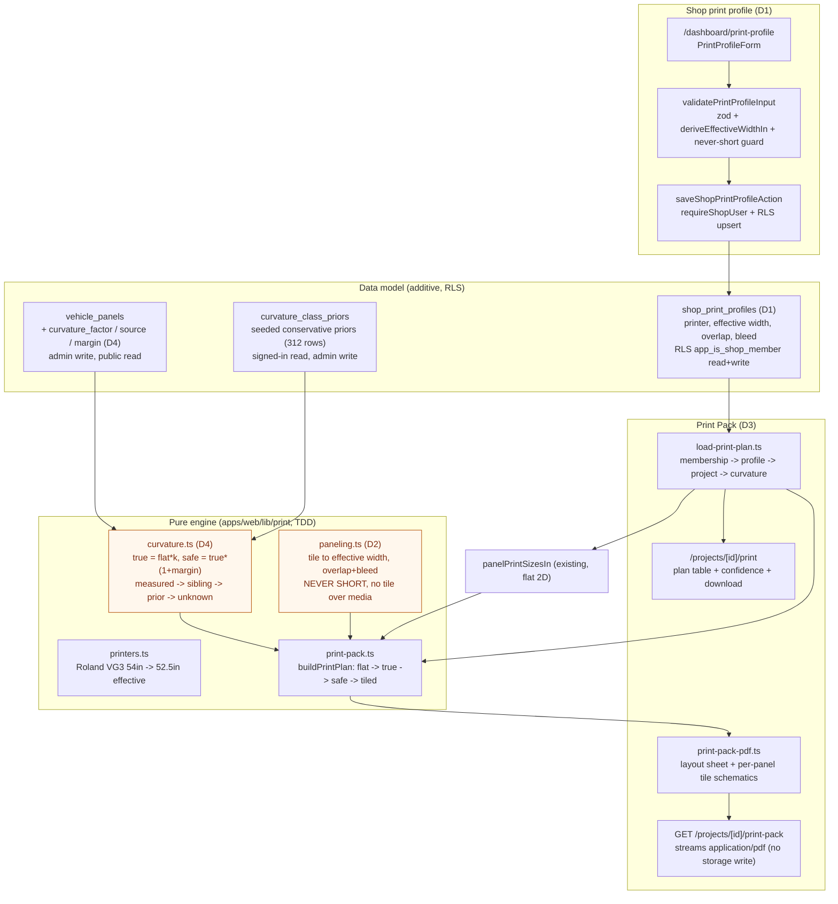

# Goal 22 - Print-ready paneling engine + shop print profile

How an approved design becomes a never-short, curvature-corrected, tiled Print Pack for a shop's
printer. Pure engine modules (TDD) sit under `apps/web/lib/print/`; the data model is additive on the
vehicle catalogue plus one per-shop table.

## Never-short chain (why nothing prints short)

1. `panelPrintSizesIn` gives the flat template size (an undercount of a curved body).
2. `curvature.ts` multiplies by a per-(body, panel-class) factor `k` (biased up), then adds a one-sided
   safety margin keyed on confidence (measured 0.02 -> calibrated 0.05 -> prior 0.08 -> unknown 0.10).
   `k` is clamped >= 1 (never shrink); `unknown` falls back to a conservative worst-case `k` + a loud
   "measure before printing" warning.
3. `paneling.ts` tiles each panel to the EFFECTIVE width (never nominal), with overlap + bleed, so the
   union of tiles net of overlaps covers at least the safe extent and no tile exceeds the media.
4. DB CHECK constraints (effective <= nominal, overlap < effective, factor > 0, margin in [0,1)) are the
   belt-and-braces backstop, proven against a real Postgres.

## What is gated / future

- Per-tile high-DPI raster crops of the actual art at print resolution (the current Print Pack carries
  exact dimensions + the layout + an optional reference preview; per-tile art crops are the next increment).
- Cross-panel nesting optimisation for linear feet (current estimate is a conservative per-panel sum).
- Live shop measurement loop to promote class priors to `measured_in_shop` (data path is built; the bulk
  measurement-entry UI is future).
- Deploy + prod migration + prod-smoke are gated on Archer's go (not run by this build).
