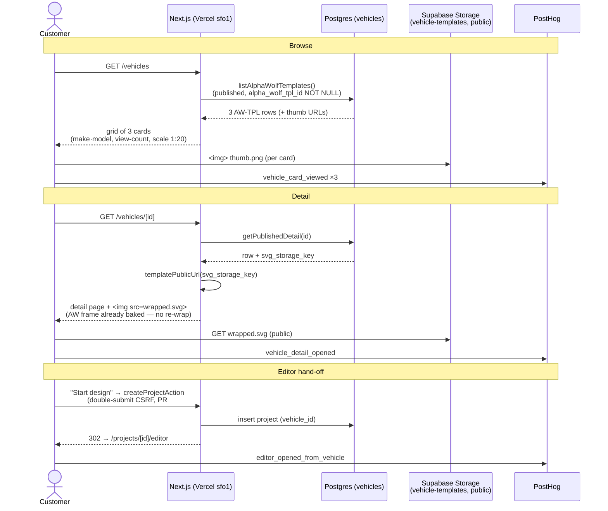

# Goal 2a — catalogue seed: browse → detail → editor

Sequence of the customer flow the 3-PR Goal-2a stack lights up: the curated
`/vehicles` grid, the wrapped-SVG detail render, and the hand-off into the
editor. The wrapped SVGs live in the **public** `vehicle-templates` Supabase
Storage bucket; the DB row carries the bucket-relative `svg_storage_key`.

## Data contract

| Layer          | Carrier                                                  | Notes                                                                               |
| -------------- | -------------------------------------------------------- | ----------------------------------------------------------------------------------- |
| Browse list    | `vehicles.listAlphaWolfTemplates()`                      | published rows with `alpha_wolf_tpl_id`, ordered by tpl id                          |
| Wrapped render | `` | public bucket; CSP `img-src` already allow-lists `dxwnzxlmggpdjyoxdybh.supabase.co` |
| Editor route   | `/projects/[id]/editor`                                  | existing; reached via `StartProjectButton` (CSRF preserved)                         |
| Events         | `posthog-js` (env-gated)                                 | `vehicle_card_viewed`, `vehicle_detail_opened`, `editor_opened_from_vehicle`        |

Seeds: **AW-TPL-0001** BMW X3 (4-view) · **AW-TPL-0002** Contender 36.5' Bass
Boat (2-view) · **AW-TPL-0003** 1973 Crown Super Coach (3-view), all 1:20.
