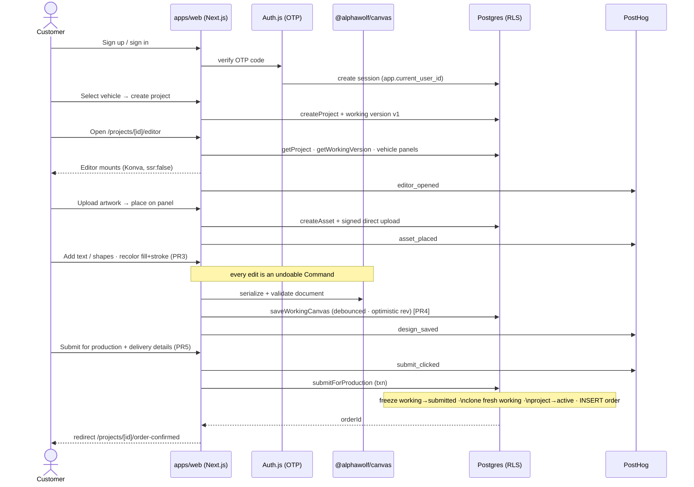

# Goal 3a — Customer journey (signup → submit)

Sequence diagram of the full canvas journey: a customer signs up, opens the
editor, places + styles artwork, autosaves, and submits for production (which
creates a `db.order` row — no payment). The four PostHog funnel events
(`editor_opened`, `asset_placed`, `design_saved`, `submit_clicked`) are shown at
the points they fire.

## Notes

- The route is `/projects/[id]/editor` (the original spec's `/editor/[projectId]`
  was superseded — confirmed against the existing route from PR #38).
- PR1 (route shell + canvas mount) and PR2 (upload + place) were already on `main`
  via PR #38; Goal 3a delivered PR3 (color), PR4 (save UX + analytics), and PR5
  (submit → order) on top.
- The order pins the **frozen** `project_versions` row; the customer keeps editing
  a freshly-cloned working version afterward (ADR-0006 §4).
