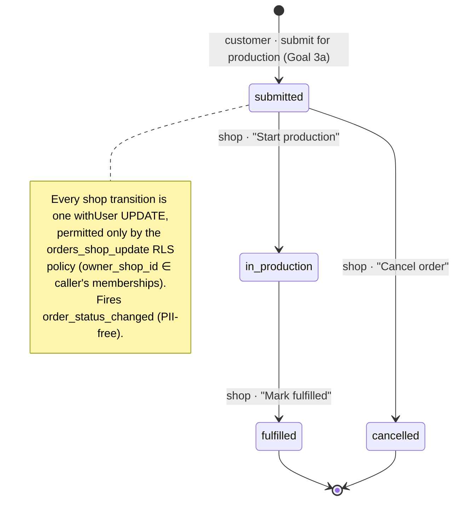

# Goal 3b — Order lifecycle (shop dashboard)

State diagram of a production order's status lifecycle. A customer creates the
order via Goal 3a's submit-for-production flow (it enters `submitted`); from
there a member of the **routing shop** drives every transition from the shop
dashboard. The forward path is `submitted → in_production → fulfilled`;
`cancelled` is reachable **only** from `submitted` (you can't cancel an order
once it's on the floor). `fulfilled` and `cancelled` are terminal.

## Enforcement & instrumentation

- **Read** (`orders_shop_read`, PR1): a shop member sees orders routed to their
  shop. The dashboard is **order-centric** — the customer's `project` /
  `project_versions` rows are owned by the customer (`projects_owner_all`) and
  are invisible to a shop member on the RLS connection, so the queue never joins
  them.
- **Transition** (`orders_shop_update`, PR3): the legal-transition graph
  (`ORDER_TRANSITIONS` / `canTransitionOrder`) is enforced in
  `transitionOrderStatus`, and the **DB** independently refuses a cross-shop or
  re-routing UPDATE (`USING` + `WITH CHECK`). The UI button map (`ORDER_ACTIONS`)
  is pinned to the same graph by tests in both packages.
- **Analytics:** `dashboard_loaded` (queue mount), `order_viewed` (detail mount),
  `order_status_changed` (successful transition). All PII-free — order id +
  status + count only.

## PR map

- **PR1 `feat/shop-dashboard-route` (#94):** `/dashboard` queue + `listShopOrders`.
- **PR2 `feat/shop-order-detail` (#95):** `/dashboard/orders/[orderId]` +
  transition actions/state machine.
- **PR3 `feat/shop-orders-rls-update` (#96):** `orders_shop_update` policy +
  cross-shop integration proof under `app_user`.
