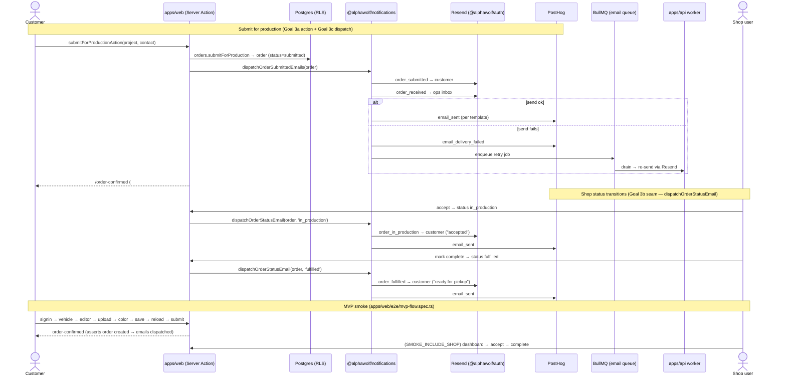

# Goal 3c — Email dispatch per state transition + smoke path

Sequence diagram of the transactional order-email layer and the canonical MVP
smoke. Email send is **best-effort and never blocks a status transition**: on a
Resend failure the dispatch captures to Sentry + PostHog (`email_delivery_failed`)
and enqueues a BullMQ retry that the `apps/api` worker drains. `order_submitted`
and `order_received` fire **now** (submit time); `order_in_production` and
`order_fulfilled` fire from the **Goal 3b seam** (`dispatchOrderStatusEmail`) once
the shop dashboard lands.

## Template ↔ OrderStatus mapping

| Template (kind)       | Recipient | Fires on                     | Status          |
| --------------------- | --------- | ---------------------------- | --------------- |
| `order_submitted`     | customer  | order creation               | `submitted`     |
| `order_received`      | ops inbox | order creation               | `submitted`     |
| `order_in_production` | customer  | accept (Goal 3b seam)        | `in_production` |
| `order_fulfilled`     | customer  | mark complete (Goal 3b seam) | `fulfilled`     |

The `OrderStatus` enum (`submitted, in_production, fulfilled, cancelled`) is the
source of truth; the spec's prose names ("accepted"/"completed") map to
`in_production`/`fulfilled`.
