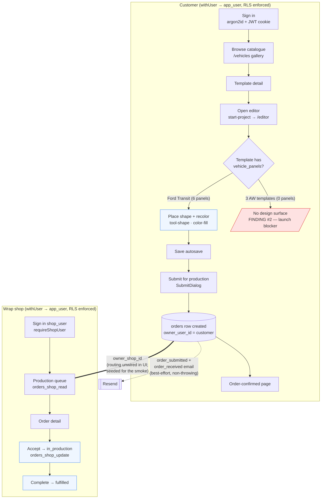

# Goal 4 — MVP verification + investor handoff

The end-to-end MVP flow as verified on production this session, with the two HIGH
findings overlaid (one fixed, one flagged).

**RLS boundary (the crown jewel).** Every customer/shop query runs on the
non-superuser `app_user` connection with row-level security forced. The shop reads an
order only via `orders_shop_read` (membership-gated); a non-member sees nothing —
verified live from a second identity.

**Finding #1 — FIXED (PR #116).** `orders_shop_read` → `EXISTS(memberships)` →
`memberships_member_select` (which self-referenced `memberships`) → `42P17` infinite
recursion, breaking the whole shop path. Now routed through the `SECURITY DEFINER`
`app_is_shop_member` helper (no RLS re-entry). Membership/tenant predicates must use
this pattern — never an inline `EXISTS(memberships …)` in a memberships policy
(ADR-0014 inv 4).

**Finding #2 — FLAGGED (launch blocker #1).** The `vehicle_panels` decision point
(`E`) is the gap: the 3 AW catalogue templates have none, so the editor is
non-functional on them. The Transit (6 panels) proves the editor works. Remediation:
author panel geometry (in-house/licensed, never PVO) — ADR-0014 inv 12.

See `dist/mvp-handoff/handoff.md` for the full findings + launch-blocker list.
