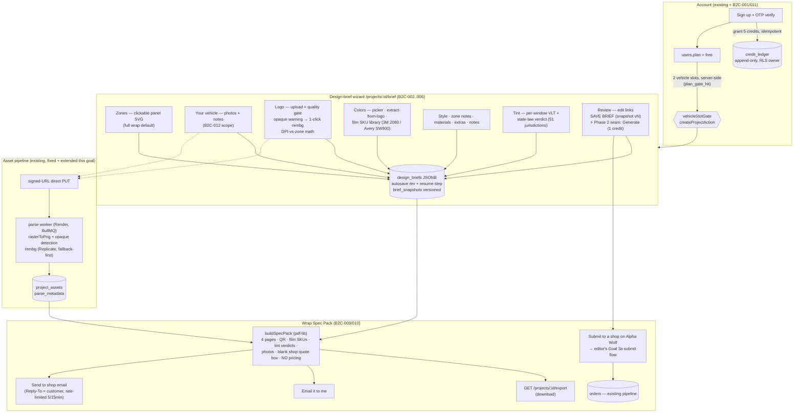
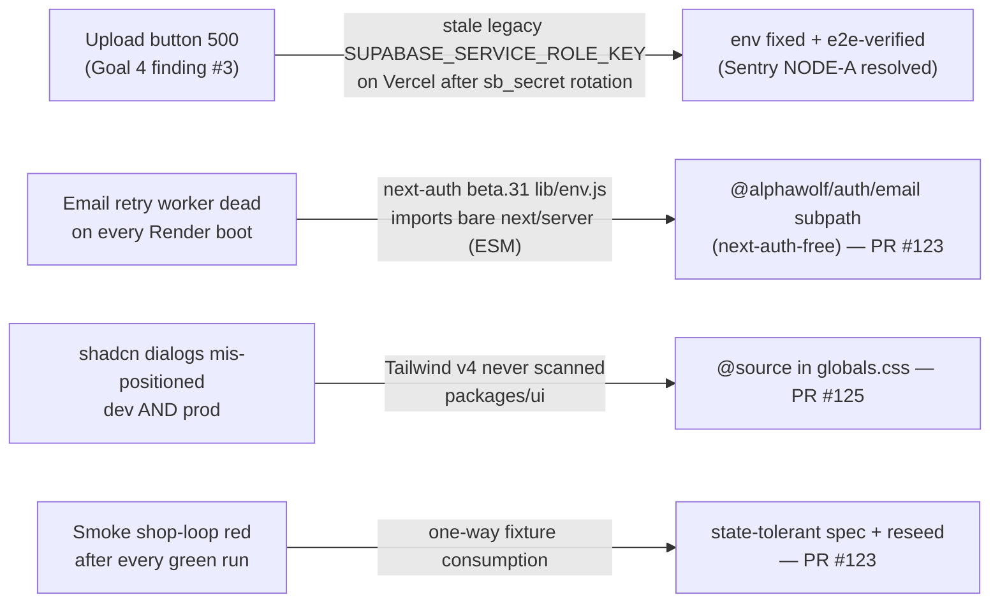

# Goal 5 — B2C Guided Design Flow, Phase 1 (brief wizard + export pack)

Shipped 2026-06-11 across PRs #119, #120, #121, #122, #123, #125, #126, #127, #128, #129, #130 (+ the smoke-promotion PR). Phase 2 (AI generation B2C-007/008, Stripe checkout B2C-013) builds on the seams marked below.

## Prod fixes shipped on the way (the B2C-004 triage)

