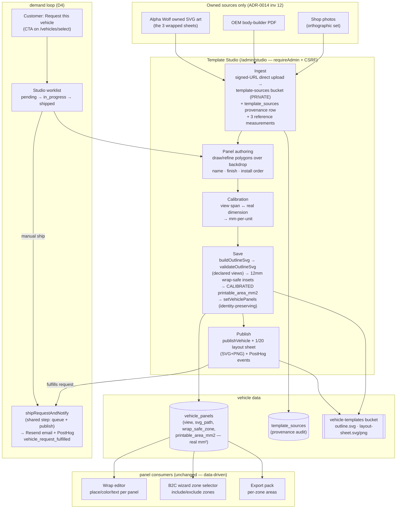

# Goal 6 — Template Studio (authoring pipeline → AW panels → functional editor)

The machine that turns owned source material into published, panel-rich
templates — and its first real output: panel sets for the 3 AW catalogue
templates, which unblocked the editor + B2C zone selector on them
(Goal 4 launch blocker #1).

## D2 — the first authored output (published to prod 2026-06-11)

| Template                        | Views                        | Panels | Side area (calibrated) |
| ------------------------------- | ---------------------------- | ------ | ---------------------- |
| AW-TPL-0001 BMW X3              | front/driver/back/passenger  | 15     | 3.0 m²                 |
| AW-TPL-0002 Contender Bass Boat | driver(port)/passenger(stbd) | 6      | 8.8 m²                 |
| AW-TPL-0003 Crown Super Coach   | driver/passenger/back        | 12     | 26.6 m²                |

QC overlays (panels composited 1:1 over the wrapped art):
`docs/deployment/screenshots/2026-06-11-goal-6/` — awaiting Archer's visual
approval (publish-then-adjust).

## Review loop that shipped it

PR #135 (foundations) went through three adversarial review rounds — the
second round caught a regression the first round's fix introduced (reflex
bevel under-clearance); the final geometry contract is ENFORCED in code
(dense boundary-clearance sampling — reject, don't repair). PRs #136/#137
caught a Render deploy-killer (canvas had no node-loadable dist), the
Server-Action 1MB body cap making the ingest unusable, and a silent
submit-button/value bug that had broken "Retire"/"Mark in review" since
GH-004.
