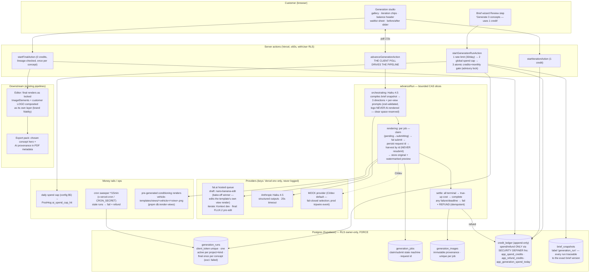

# Goal 7 — AI Generation (B2C Phase 2) — architecture

Shipped 2026-06-12 across PRs #143 (adapter + bake-off harness), #144 (panel-number rider), #145/#146 (deploy/MIME fixes), #147 (orchestrator), #148/#149 (data layer + money rails), #150 (pipeline runtime), #151 (bake-off verdict), #152/#153 (merge-interaction test fixes), #154 (generation studio UI).

**Locked invariants carried forward:** two-connection DB split (`withSystem` only in the sweeper + global-spend scalar read); credit_ledger append-only with app_user INSERT revoked; grant-only credits (waitlist sheet, NO Stripe); ADR-0013 deploy config untouched; `maxDuration ≤ 60` everywhere (hobby plan rejects deploys above it — learned the hard way).
