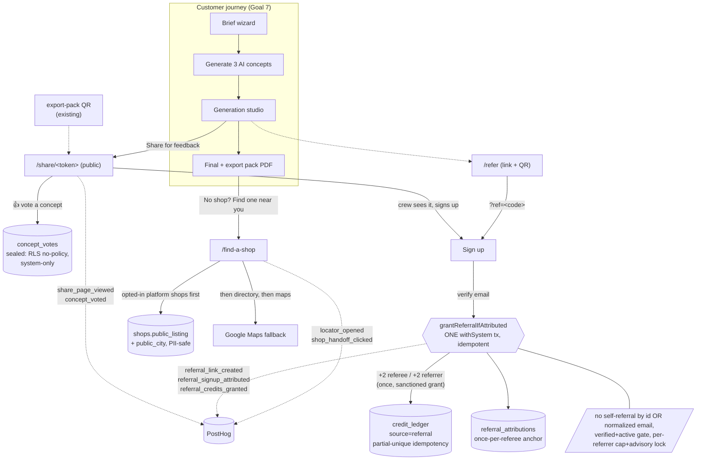
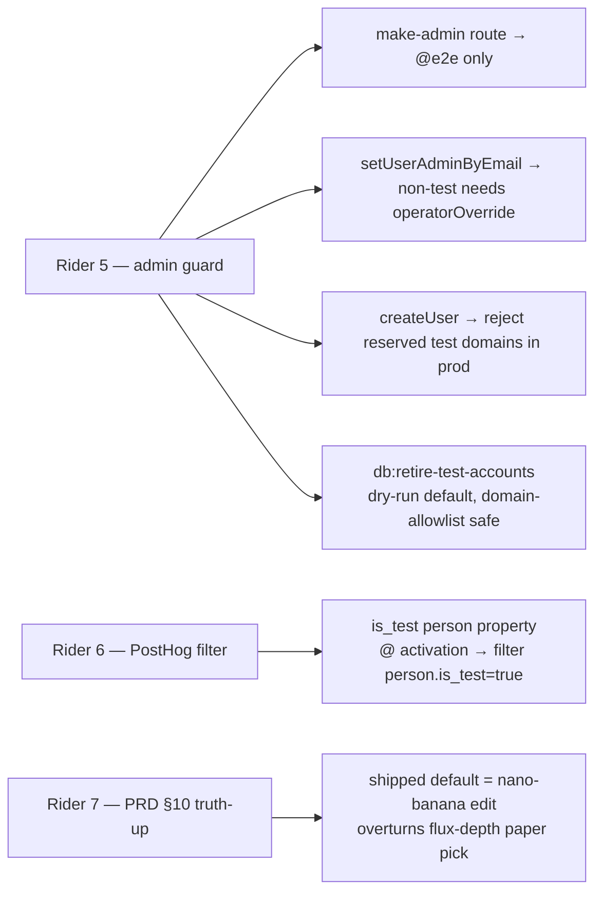

# Goal 9 — Growth loops + polish (diagram)

Shipped 2026-06-13. Share-for-feedback voting, referral give-2/get-2, shop locator
handoff, polish pass, + 3 hygiene riders. PRs #158, #159, #160, #161, #163, #164.

## The growth loops on the export funnel

## Hygiene riders

## Security posture (the point of D1/D2/rider-5)

- **concept_votes** — sealed ballot box: RLS enabled+forced, 0 policies, app_user grants revoked. System connection only.
- **Share read** — withSystem, token-gated, whitelisted columns only (vehicle label + concept key/title/summary + watermarked previewPath + vote tally). No PII, ever. Verified live on prod (no owner/email/name in the rendered page).
- **Referral** — credits minted only via the sanctioned append-only ledger (system-written, partial-unique idempotent); referral_attributions system-written, referrer-read-only (referee can't see who referred them).
- **Admin elevation** — only real staff (CLI override) or synthetic test identities (retired) can ever hold is_admin.

All three security-gated PRs (D1, D2, rider 5) carry an independent §3 second security review (APPROVE WITH NITS, all addressed).
