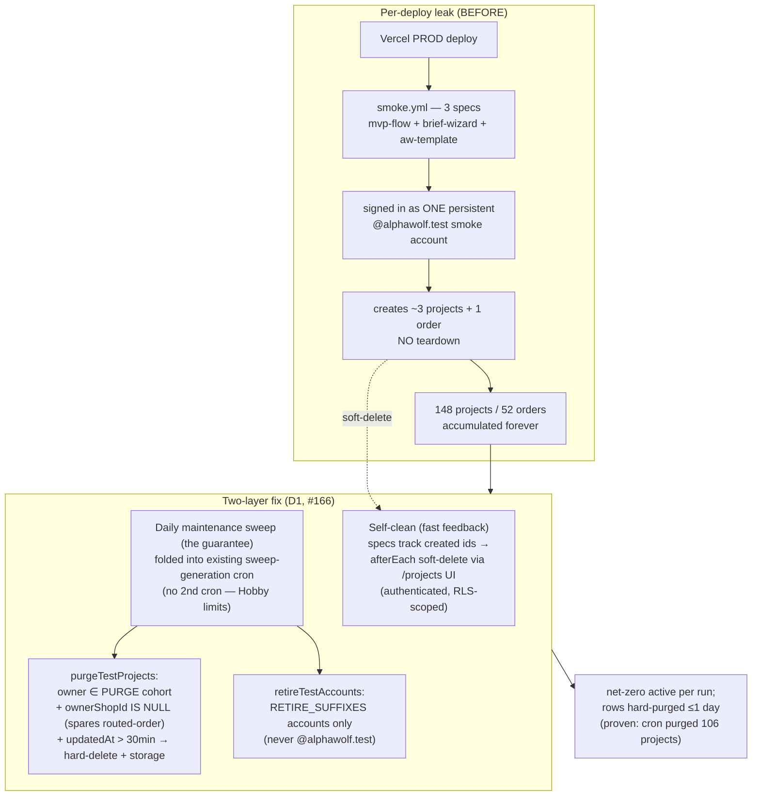
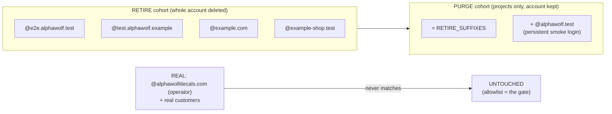
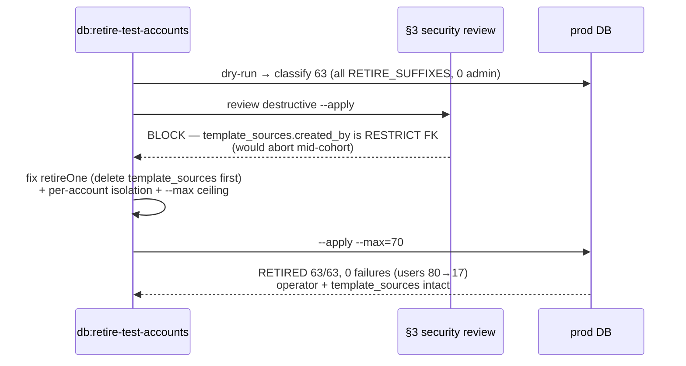
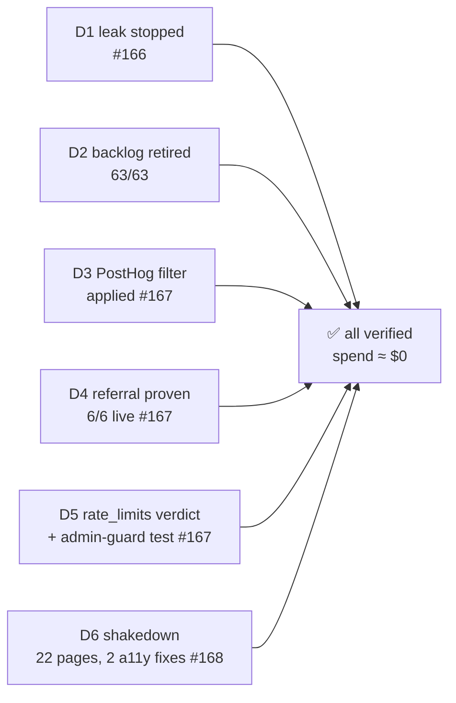

# Goal 9.1 — Cleanup & closeout

How the prod test-data leak was stopped, the backlog retired, and the two riders finished.

## The leak and the two-layer fix (D1)

## Cohorts — the safety guarantee

## D2 retirement + the security-review fix

## Deliverables → outcome

